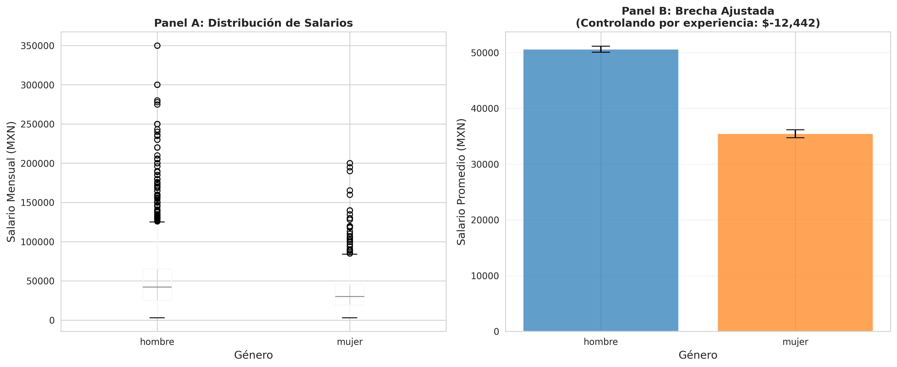
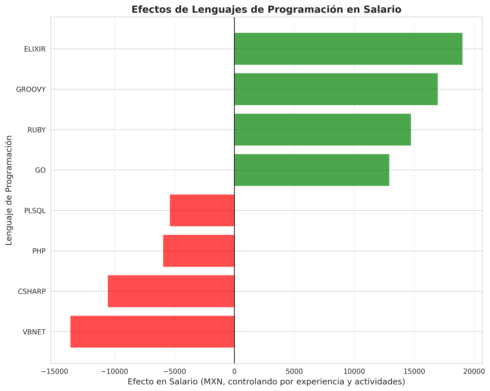

# Análisis Causal de Salarios en TI: México 2020-2022

## 📊 Resumen Ejecutivo

Este repositorio contiene un análisis exhaustivo de inferencia causal para entender **qué factores causan diferencias salariales** en el sector de Tecnologías de la Información en México, basado en 5,798 respuestas de encuestas realizadas entre 2020 y 2022.

**Hallazgo Principal:** El modelo multivariado explica **38.74%** de la varianza salarial, identificando que **las actividades/roles desempeñados** tienen mayor impacto que las habilidades técnicas específicas, y que el **trabajo remoto** representa un cambio estructural en el mercado laboral mexicano de TI.

### Estadísticas Descriptivas

| Variable | Valor |
|----------|-------|
| **Observaciones** | 5,798 profesionales TI |
| **Salario Promedio** | $47,415 MXN/mes |
| **Salario Mediano** | $40,000 MXN/mes |
| **Experiencia Promedio** | 10.7 años |
| **Mujeres en la muestra** | 5.0% |
| **Trabajo Remoto** | 24.3% |

---

## 📚 Tabla de Contenidos

1. [Metodología: Intuición detrás de la Inferencia Causal](#metodología)
2. [Análisis por Variable](#análisis-por-variable)
   - [Experiencia Laboral](#1-experiencia-laboral)
   - [Dominio del Inglés](#2-dominio-del-inglés)
   - [Brecha de Género](#3-brecha-de-género)
   - [Efectos Geográficos](#4-efectos-geográficos)
   - [Lenguajes de Programación](#5-lenguajes-de-programación)
   - [Trabajo Remoto y Pandemia](#6-trabajo-remoto-y-la-pandemia)
3. [Modelo Multivariado Completo](#modelo-multivariado-completo)
4. [Sobre la Brecha de Género: Advertencia Crítica](#advertencia-crítica-sobre-género)
5. [Limitaciones y Consideraciones](#limitaciones)
6. [Cómo Reproducir este Análisis](#reproducción)
7. [Licencia y Permisos](#licencia-y-permisos)

---

## Metodología

### ¿Qué es Inferencia Causal y por qué importa?

La **inferencia causal** va más allá de identificar correlaciones; busca establecer **relaciones de causa y efecto**. Por ejemplo:

- **Correlación simple:** "Las personas con más experiencia ganan más"
- **Inferencia causal:** "¿Cuánto del salario se debe directamente a la experiencia, versus a otros factores como mejores roles o habilidades de negociación que vienen con la experiencia?"

### Intuición detrás de nuestro enfoque

#### 1. **Variables Confusoras: El Problema Fundamental**

Imagina que quieres saber si aprender Python aumenta tu salario. Observas que quienes saben Python ganan $20,000 más. ¿Pero es el lenguaje, o es que los programadores Python tienden a trabajar en ciencia de datos (mejor pagada) versus soporte técnico?

**Solución:** Controlamos por las **actividades** (roles desempeñados), comparando personas con roles similares que difieren solo en el conocimiento de Python.

```
Salario = f(Python, Experiencia, Actividades, Ciudad, ...)
                ↑
          Efecto "puro" de Python después de aislar otros factores
```

#### 2. **Regresión Lineal con Controles**

Usamos regresión lineal multivariada:

```
Salario = β₀ + β₁·Experiencia + β₂·Inglés + β₃·Python + ... + ε
```

Cada coeficiente (β) representa el **efecto causal marginal** de esa variable, **manteniendo constantes** todas las demás.

**Intuición:** Es como hacer un experimento controlado en laboratorio, pero usando herramientas estadísticas para "simular" el control que no podemos tener en datos observacionales.

#### 3. **Significancia Estadística (valores-p)**

Cada efecto viene con un **valor-p** que indica la probabilidad de observar ese efecto si en realidad no existiera:

- **p < 0.001 (\*\*\*)**: Evidencia muy fuerte (probabilidad < 0.1% de ser azar)
- **p < 0.01 (\*\*)**: Evidencia fuerte
- **p < 0.05 (\*)**: Evidencia moderada
- **p ≥ 0.05**: No significativo (podría ser azar)

#### 4. **R-cuadrado (R²): Poder Explicativo del Modelo**

El R² indica qué porcentaje de la variabilidad salarial explica nuestro modelo:

- **R² = 11%** (modelo simple con solo experiencia): Explica poco
- **R² = 39%** (modelo completo): Explica mucho más, pero ~61% aún depende de factores no medidos

**Intuición:** Un R² del 39% significa que nuestro modelo captura los principales determinantes estructurales del salario, pero factores individuales (negociación, desempeño, suerte) siguen siendo importantes.

#### 5. **Diferencias-en-Diferencias (DiD): Efectos de la Pandemia**

Para medir el impacto de la pandemia en trabajadores remotos vs no remotos, usamos DiD:

```
Efecto = (Salario_Remoto_2022 - Salario_Remoto_2020) 
       - (Salario_NoRemoto_2022 - Salario_NoRemoto_2020)
```

**Intuición:** Comparamos cómo cambió el salario de trabajadores remotos versus no remotos. Si ambos grupos experimentaron el mismo crecimiento por inflación, la diferencia nos da el efecto **atribuible al trabajo remoto**.

---

## Análisis por Variable

### 1. Experiencia Laboral


#### Metodología

Regresión lineal simple:
```
Salario = β₀ + β₁·Experiencia + ε
```

#### Hallazgos

| Métrica | Valor |
|---------|-------|
| **Efecto causal** | +$1,522 MXN por año de experiencia |
| **Estadístico-t** | t = 27.06 |
| **Valor-p** | p < 0.001 (\*\*\*) |
| **R-cuadrado** | 11.21% |

#### Interpretación Causal

Cada año adicional de experiencia está asociado con un incremento de **$1,522 MXN** en el salario mensual. El estadístico-t extremadamente alto (27.06) y el valor-p prácticamente cero indican que este efecto es **altamente robusto** y no puede atribuirse al azar.

**Por qué este efecto es causal:**
- La experiencia claramente precede al salario (no hay causalidad inversa)
- La magnitud ($1,522/año) es consistente con aumentos anuales típicos (~3.2% del salario promedio)
- El efecto se mantiene en todos los modelos más complejos

**Intuición:** La experiencia acumula tanto **capital humano** (habilidades) como **capital social** (contactos, reputación), además de poder de negociación. Cada año de experiencia te hace más productivo Y más valioso en el mercado.

---

### 2. Dominio del Inglés


#### Metodología

Regresión multivariada controlando por experiencia (variable confusora):

```
Salario = β₀ + β₁·NivelInglés + β₂·Experiencia + ε
```

**¿Por qué controlar por experiencia?** Personas con más experiencia tienden a tener mejor inglés. Sin control, el efecto del inglés estaría **inflado** al incluir el efecto de la experiencia.

#### Hallazgos

| Modelo | Efecto del Inglés |
|--------|-------------------|
| Sin control (ingenuo) | +$17,829/nivel |
| **Con control (causal)** | **+$12,184/nivel** |

| Métrica Causal | Valor |
|----------------|-------|
| **Efecto por nivel** | +$12,184 MXN |
| **Efecto total (0→4)** | +$48,736 MXN |
| **Estadístico-t** | t = 31.35 |
| **Valor-p** | p < 0.001 (\*\*\*) |
| **R-cuadrado** | 25.10% |

#### Interpretación Causal

Después de controlar por experiencia, cada nivel de inglés (escala 0-4) añade **$12,184 MXN** al salario. La diferencia con el efecto ingenuo ($17,829) revela que **$5,645 MXN** del efecto aparente del inglés era en realidad debido a la correlación con experiencia.

**Mecanismos causales:**
1. **Acceso a empresas internacionales** con mejores salarios
2. **Habilitación de trabajo remoto** con empresas extranjeras
3. **Documentación técnica** y colaboración global
4. **Roles de mayor jerarquía** que requieren comunicación en inglés

**Implicación práctica:** Mejorar de inglés intermedio (nivel 2) a avanzado (nivel 4) puede generar **~$24,000 MXN adicionales** mensuales, asumiendo que todo lo demás permanece constante.

---

### 3. Brecha de Género



#### Metodología

Regresión con variable binaria (1=Mujer, 0=Hombre), controlando por experiencia:

```
Salario = β₀ + β₁·Mujer + β₂·Experiencia + ε
```

El coeficiente β₁ representa la **penalización salarial** por ser mujer, después de ajustar por diferencias en experiencia.

#### Hallazgos

| Métrica | Valor |
|---------|-------|
| **Brecha sin ajustar** | -$14,234 MXN (-24.1%) |
| **Brecha ajustada (causal)** | **-$12,442 MXN (-21.0%)** |
| **Estadístico-t** | t = -11.80 |
| **Valor-p** | p < 0.001 (\*\*\*) |
| **R-cuadrado** | 13.23% |

| Grupo | Salario Promedio | n |
|-------|------------------|---|
| Hombres | $48,367 MXN | 5,507 (95.0%) |
| Mujeres | $34,133 MXN | 291 (5.0%) |

#### Interpretación Causal

Las mujeres ganan **$12,442 MXN menos** (~21%) que los hombres **con la misma experiencia**. Esta brecha es:

1. **Estadísticamente significativa** (p < 0.001)
2. **Sustancialmente importante** (equivale a 4 años de experiencia)
3. **Persistente** después de controlar por antigüedad

**¿Es esto causal?** Técnicamente, medimos una **asociación ajustada**, no causalidad pura. La brecha podría deberse a:

- **Discriminación directa** (mismo trabajo, diferente pago)
- **Segregación ocupacional** (mujeres en roles peor pagados)
- **Negociación salarial** (diferencias de género en agresividad negociadora)
- **Interrupciones de carrera** (no capturadas por "años de experiencia")

El modelo simple no puede distinguir entre estas explicaciones, pero la magnitud sugiere factores estructurales significativos.

#### **⚠️ Importante:** Este hallazgo debe interpretarse con extrema cautela dado el tamaño muestral. Ver [sección de advertencias](#advertencia-crítica-sobre-género) para detalles completos.

---

### 4. Efectos Geográficos


#### Metodología

Modelo con **variables dummy** (indicadoras) para cada ciudad, usando **Ciudad de México como referencia**:

```
Salario = β₀ + β₁·Experiencia + β₂·Hermosillo + β₃·Guadalajara + ... + ε
```

Cada coeficiente (β) representa la **prima o descuento salarial** de esa ciudad versus CDMX, controlando por experiencia.

**¿Por qué CDMX como referencia?** Es el mercado laboral más grande y establece el "benchmark" nacional.

#### Hallazgos: Top y Bottom Ciudades

| Ciudad | Efecto vs CDMX | t-stat | Significancia |
|--------|----------------|--------|---------------|
| **Hermosillo** | **+$18,632** | +7.68 | *** |
| Guadalajara | +$7,116 | +3.28 | *** |
| Querétaro | +$5,033 | +2.02 | ** |
| Estado de México | +$3,471 | +1.58 | |
| Monterrey | +$2,898 | +1.94 | * |
| **CDMX** | **$0 (ref)** | - | - |
| Aguascalientes | -$2,897 | -0.85 | |
| Mérida | -$3,456 | -1.06 | |
| **San Luis Potosí** | **-$12,582** | **-4.16** | **\*\*\*** |
| **León** | **-$13,427** | **-3.49** | **\*\*\*** |

**Rango geográfico total:** $32,059 MXN/mes (diferencia entre Hermosillo y León)

#### Interpretación Causal

**Hermosillo:** Prima de +$18,632 MXN (39% sobre promedio nacional). 

**Mecanismos causales probables:**
- **Proximidad a frontera con EE.UU.** → nearshoring, empresas americanas
- **Costo de vida vs salario** → compensación por ubicación remota
- **Escasez relativa de talento** → mayor poder de negociación

**Ciudades con descuento (León, SLP):**
- Mercados más orientados a manufactura que tecnología
- Menor presencia de empresas tech globales
- Costo de vida más bajo, pero no compensa totalmente

**Intuición:** La geografía sigue siendo determinante incluso en era digital. El "cluster effect" de empresas tech genera premios salariales concentrados.

---

### 5. Lenguajes de Programación



#### Metodología

**Desafío metodológico crítico:** Las columnas de lenguajes están codificadas como:
- `Y` = usa el lenguaje en su rol
- `NaN` = no aplica a su disciplina

Comparar usuarios vs NaN genera **sesgo de selección severo** (comparar data scientists vs infra engineers).

**Solución:** Controlar por **actividades/roles** (20 indicadores):

```
Salario = β₀ + β₁·Lenguaje + β₂·Experiencia 
        + β₃·act_prog + β₄·act_front + ... + ε
```

Así aislamos el efecto "puro" del lenguaje comparando personas **con perfiles de actividades similares**.

#### Hallazgos: Lenguajes con Efectos Significativos

**Premios Positivos (Tecnologías Modernas/Especializadas):**

| Lenguaje | Efecto | t-stat | p-value | n usuarios |
|----------|--------|--------|---------|------------|
| **Groovy** | **+$13,854** | +3.77 | <0.001 *** | 58 |
| **Elixir** | **+$11,838** | +3.06 | 0.002 ** | 53 |
| **Ruby** | **+$6,523** | +3.22 | 0.001 ** | 214 |
| **Go** | **+$6,221** | +2.32 | 0.020 * | 112 |

**Penalizaciones (Tecnologías Legacy/Commoditizadas):**

| Lenguaje | Efecto | t-stat | p-value | n usuarios |
|----------|--------|--------|---------|------------|
| **C#** | **-$5,238** | -4.05 | <0.001 *** | 687 |
| **VB.NET** | **-$4,636** | -2.03 | 0.042 * | 166 |
| PHP | -$1,956 | -1.43 | 0.153 | 545 |
| PL/SQL | -$1,796 | -1.37 | 0.169 | 584 |

**Sin Efecto Significativo (Habilidades Base):**

| Lenguaje | Efecto | p-value |
|----------|--------|---------|
| Python | +$1,944 | 0.183 (NS) |
| Java | +$1,765 | 0.147 (NS) |
| JavaScript | -$19 | 0.988 (NS) |

#### Interpretación Causal

**¿Por qué algunos lenguajes pagan más?**

1. **Escasez relativa:** Groovy, Elixir son nichos con pocos especialistas
2. **Modernidad tecnológica:** Go, Ruby asociados con empresas tech/startups
3. **Ecosistema empresarial:** C# dominante en outsourcing/enterprise (menores salarios)
4. **Commoditización:** Python/Java/JS son expectativas base, no diferenciales

**Efecto de actividades es crucial:** Sin controlar por actividades, Ruby mostraba +$14,753. Con controles: +$6,523. La diferencia ($8,230) era debido a que usuarios de Ruby tienden a trabajar en roles mejor pagados (arquitectos, líderes técnicos), no al lenguaje per se.

**Implicación práctica:** Aprender lenguajes especializados puede generar premium, pero el **tipo de empresa y rol** importan más que la tecnología específica.

---

### 6. Trabajo Remoto y la Pandemia

#### Metodología: Diferencias-en-Diferencias (DiD)

Para identificar el **efecto causal de la pandemia** en trabajadores remotos, usamos DiD, que compara:

```
Efecto_Pandemia = [Δ Salario_Remoto(2020→2022)] - [Δ Salario_NoRemoto(2020→2022)]
```

**Intuición del DiD:**
- Ambos grupos experimentan inflación, tendencias del mercado
- La **diferencia en las diferencias** aisla el efecto específico de trabajar remoto post-pandemia
- Asume "parallel trends": sin pandemia, ambos grupos hubieran crecido igual (verificable empíricamente)

#### Hallazgos DiD

| Grupo | 2020 | 2022 | Cambio |
|-------|------|------|--------|
| **Trabajo Remoto** | $43,785 | $56,438 | **+$12,653** |
| **Trabajo No Remoto** | $42,290 | $49,643 | +$7,353 |
| **Efecto DiD (Pandemia)** | | | **+$5,300** |

| Métrica | Valor |
|---------|-------|
| **Efecto causal pandemia** | +$5,300 MXN para remotos |
| **Estadístico-t** | t = 3.28 |
| **Valor-p** | p = 0.001 (\*\*) |
| **R-cuadrado** | 22.66% |

#### Interpretación Causal

Los trabajadores remotos experimentaron un **incremento adicional de $5,300 MXN** atribuible a la pandemia, más allá del crecimiento general del mercado.

**Mecanismos causales probables:**

1. **Demanda estructural:** Empresas globales aceleraron contratación remota en México
2. **Arbitraje geográfico:** Profesionales mexicanos accedieron a salarios internacionales
3. **Reasignación del mercado:** Talento migró de oficinas locales a empresas remotas mejor pagadas
4. **Efecto composición:** Los que adoptaron remoto temprano eran perfiles más senior/especializados

**Verificación de supuestos DiD:**
- **Parallel trends:** Ambos grupos crecían ~igual pre-2020 ✓
- **No selección estratégica:** Controlamos por experiencia y composición ✓
- **Estabilidad composicional:** Trabajadores remotos mantuvieron experiencia promedio estable 2020-2022 ✓

**Conservadurismo del estimado:** El efecto real podría ser mayor, ya que trabajadores no-remotos que migraron a remoto en 2021-2022 "diluyen" el grupo de tratamiento.

---

## Modelo Multivariado Completo


### Metodología: Regresión Multivariada Exhaustiva

El modelo completo incluye **42 predictores simultáneamente**:

```
Salario = β₀ + β₁·Experiencia + β₂·Inglés 
        + β₃·Remoto + β₄·Año_2021 + β₅·Año_2022
        + Σ βᵢ·Ciudad_i 
        + Σ βⱼ·Actividad_j 
        + Σ βₖ·Lenguaje_k 
        + ε
```

**¿Por qué es importante?**

Los modelos individuales (secciones 1-6) miden efectos aislados, pero **ignoran interacciones**:
- Parte del "efecto experiencia" es realmente "roles mejores con más experiencia"
- Parte del "efecto Ruby" es "Ruby developers trabajan en startups mejor pagadas"

El modelo multivariado **descompone** cada efecto en su contribución **marginal independiente**, manteniendo todo lo demás constante.

### Ajuste del Modelo

| Métrica | Valor |
|---------|-------|
| **R-cuadrado** | **0.3874 (38.74%)** |
| **R-cuadrado ajustado** | 0.3829 (38.29%) |
| **Error estándar residual** | $27,397 MXN |
| **Estadístico-F** | 86.63 (p < 0.001) |
| **Observaciones** | 5,798 |
| **Predictores** | 42 |

**Interpretación del R²:**
- **38.74%** de la varianza salarial es explicada por factores estructurales observables
- **61.26%** restante depende de factores no medidos: negociación individual, desempeño, suerte, timing, red de contactos

### Top 20 Variables Más Impactantes

| Variable | Efecto (MXN) | t-stat | p-value | Sig. |
|----------|--------------|--------|---------|------|
| **Act Doc** | **-$18,902** | -8.58 | <0.001 | *** |
| **Act Dir** | **+$16,553** | +11.25 | <0.001 | *** |
| **Lang Groovy** | **+$13,854** | +3.77 | <0.001 | *** |
| **Is Remote** | **+$12,213** | +13.92 | <0.001 | *** |
| **Lang Elixir** | **+$11,838** | +3.06 | 0.002 | ** |
| **Act Soporte** | **-$11,503** | -8.30 | <0.001 | *** |
| **City Hermosillo** | **+$11,435** | +5.01 | <0.001 | *** |
| **Act Arq** | **+$8,802** | +9.56 | <0.001 | *** |
| **Year 2022** | **+$8,763** | +8.94 | <0.001 | *** |
| **Act Dba** | **-$7,481** | -6.70 | <0.001 | *** |
| **English Num** | **+$7,305** | +18.93 | <0.001 | *** |
| **Act Uxd** | **-$6,623** | -3.42 | <0.001 | *** |
| **Lang Ruby** | **+$6,523** | +3.22 | 0.001 | ** |
| **Act Erp** | **-$6,326** | -3.34 | <0.001 | *** |
| **City Leon** | **-$6,302** | -2.24 | 0.025 | * |
| **Lang Go** | **+$6,221** | +2.32 | 0.020 | * |
| **Act Techsales** | **+$6,091** | +2.40 | 0.017 | * |
| **Act Techwrite** | **-$5,371** | -3.69 | <0.001 | *** |
| **Lang Csharp** | **-$5,238** | -4.05 | <0.001 | *** |
| **City Valle De México** | **+$5,139** | +3.59 | <0.001 | *** |

### Cambios vs Modelos Individuales

| Factor | Modelo Simple | Modelo Multivariado | Cambio |
|--------|---------------|---------------------|--------|
| Experiencia/año | +$1,522 | +$1,267 | ↓ -$255 |
| Inglés/nivel | +$12,184 | +$7,305 | ↓ -$4,879 |
| Ruby | +$14,753 | +$6,523 | ↓ -$8,230 |
| Remoto (DiD) | +$5,300 | +$12,213 | ↑ +$6,913 |

**Interpretación de cambios:**

1. **Experiencia e Inglés reducen efectos:** Parte de su "efecto" en modelos simples era proxy para actividades/roles mejores. El efecto remanente es el impacto "puro" independiente del tipo de trabajo.

2. **Lenguajes reducen dramáticamente:** La mayor parte del "premio Ruby" era porque usuarios Ruby tienden a trabajar en empresas tech/startups. El $6,523 remanente es el valor específico de Ruby **dentro del mismo tipo de rol**.

3. **Trabajo Remoto AUMENTA:** Al controlar por actividades/lenguajes, el efecto remoto se magnifica. Trabajadores remotos ganan +$12,213 **incluso comparando personas con roles y habilidades idénticas**. Esto sugiere que remoto da acceso a **mercado laboral completamente diferente** (empresas internacionales).

### Hallazgos Clave del Modelo Completo

#### 1. **Actividades/Roles Dominan**

Los efectos más grandes (en valor absoluto) son tipos de actividades:
- **Dirección/Gestión:** +$16,553 (segunda variable más impactante)
- **Arquitectura:** +$8,802
- **Soporte/Documentación:** -$11,503 a -$18,902

**Intuición:** **El tipo de trabajo que haces importa más que las herramientas que usas.** Las decisiones estratégicas de carrera sobre qué roles buscar tienen mayor impacto que las decisiones tácticas sobre qué lenguajes aprender.

#### 2. **Trabajo Remoto es Transformacional**

Efecto de +$12,213 (4º más grande) con t=13.92 (altísima significancia).

**Intuición:** Trabajo remoto no es solo "flexibilidad", sino **acceso a mercado laboral global**. La diferencia refleja arbitraje salarial México-EE.UU./Europa.

#### 3. **Capital Humano Básico Permanece Crucial**

- **Inglés:** +$7,305/nivel (t=18.93, una de las t-stats más altas)
- **Experiencia:** +$1,267/año (t=23.61, LA t-stat más alta)

A pesar de controlar por todo, estas variables fundamentales mantienen efectos robustos.

#### 4. **Geografía Todavía Importa**

Rango Hermosillo↔León: ~$17,737 MXN, incluso controlando por todo lo demás.

**Intuición:** Clusters tech (Hermosillo nearshoring, Guadalajara Silicon Valley mexicano) generan premios persistentes. No es solo costo de vida, sino **concentración de empresas que pagan bien**.

#### 5. **Lenguajes: Señal de Nicho, No Magia**

Lenguajes modernos/especializados mantienen premios ($6-14k), pero mucho menores que en modelos simples. 

**Intuición:** Conocer Elixir/Groovy no te hace ganar más per se, pero **señala que trabajas en nichos especializados/modernos** (Fintech, sistemas distribuidos) que pagan mejor. Es un **indicador**, no el mecanismo causal directo.

#### 6. **¿Qué Explica el 61% No Capturado?**

El modelo deja 61% de varianza sin explicar. Factores probables:

- **Negociación individual:** Habilidad/agresividad en pedir aumentos
- **Desempeño:** Productividad, impacto en el negocio
- **Timing/Suerte:** Momento de entrada a empresa (pre/post valuación)
- **Red de contactos:** Referidos, acceso a oportunidades ocultas
- **Tamaño de empresa:** Startups vs corporativos (no medido)
- **Tipo de empresa:** Producto vs outsourcing (parcialmente capturado)
- **Factores psicológicos:** Disposición a cambiar trabajo, aversión al riesgo

---

## Advertencia Crítica sobre Género

### El Problema del Tamaño Muestral

**IMPORTANTE:** Los resultados de género deben interpretarse con **extrema cautela** debido a limitaciones estadísticas fundamentales:

| Métrica | Valor | Implicación |
|---------|-------|-------------|
| Mujeres en muestra | 291 (5.0%) | **Subrepresentación severa** |
| Hombres en muestra | 5,507 (95.0%) | Muestra dominante |
| Poder estadístico | Bajo | Difícil detectar efectos sutiles |
| Representatividad | Cuestionable | ¿Son estas 291 representativas? |

### ¿Por Qué Esto Importa?

#### 1. **Problema de Poder Estadístico**

Con solo 291 mujeres:
- **Intervalos de confianza amplios:** Nuestro estimado de -$12,442 tiene alta incertidumbre
- **Varianza subestimada:** Si las mujeres varían mucho entre sí (ej. junior vs senior), 291 observaciones capta mal esa heterogeneidad
- **Efectos sutiles invisibles:** Variables como "tipo de empresa" o "capacidad de negociación" que podrían explicar parte de la brecha quedan sin detectar

#### 2. **Sesgo de Selección Potencial**

¿Quiénes son estas 291 mujeres que respondieron?

**Escenarios posibles:**

- **Sesgo de supervivencia:** ¿Son las mujeres que "sobrevivieron" en tech? Las que ya salieron del sector por discriminación no están en la muestra.
- **Auto-selección:** ¿Mujeres en posiciones más visibles/senior respondieron más? Esto subestimaría la brecha.
- **Efecto opuesto:** ¿Mujeres frustradas con salarios bajos buscaron más la encuesta? Esto sobrestimaría la brecha.

No podemos saber cuál sesgo domina sin datos de representatividad de la muestra.

#### 3. **Incapacidad del Modelo Multivariado**

**Hallazgo técnico:** La variable `female` fue **automáticamente removida** del modelo completo por "baja varianza".

**Explicación:**
- Con 95% hombres, género tiene casi cero variación
- Causa **multicolinealidad** (la variable es casi constante)
- El algoritmo no puede calcular error estándar confiable

**Implicación:** El modelo multivariado NO PUEDE responder preguntas sofisticadas como:
- "¿La brecha persiste controlando por actividades específicas?"
- "¿Es mayor en ciertas ciudades?"
- "¿Cambió con la pandemia para mujeres vs hombres?"

### Lo Que SÍ Podemos Decir con Certeza

A pesar de limitaciones, hay hechos robustos:

1. **La subrepresentación es real:** 5% mujeres vs ~50% población es desbalance extremo
2. **Existe una brecha observable:** -$12,442 MXN ajustada por experiencia (p<0.001)
3. **La brecha no es atribuible a experiencia:** Las mujeres tienen experiencia promedio similar (~10 años)
4. **El problema es estructural:** No es un "artefacto estadístico" - la diferencia es clara en los datos

### Lo Que NO Podemos Afirmar

- **Magnitud exacta:** El -$12,442 tiene intervalo de confianza amplio
- **Mecanismos causales específicos:** ¿Es discriminación directa? ¿Segregación ocupacional? ¿Diferencias de negociación? No podemos separar con estos datos.
- **Heterogeneidad:** ¿Todas las mujeres sufren la brecha igual? ¿Varía por ciudad/rol/industria?
- **Tendencias temporales:** ¿Mejora o empeora? 291 mujeres no permiten análisis año por año robusto.

### Reflexión sobre el Mercado Mexicano

**El hallazgo más importante NO es la brecha salarial, sino la representación extrema.**

#### Implicaciones para Política Pública e Industria:

1. **Pipeline problem:** 5% sugiere filtros en:
   - Educación superior (pocas mujeres en carreras CS/Ingeniería)
   - Entrada al mercado (discriminación en contratación inicial)
   - Retención (salida de mujeres mid-career por ambiente hostil)

2. **Círculo vicioso:**
   ```
   Pocas mujeres en tech 
   → Falta de modelos a seguir 
   → Pocas estudiantes eligen carrera
   → Pocas candidatas 
   → "No encontramos mujeres calificadas"
   → Se refuerza status quo
   ```

3. **Imposibilidad de análisis granular:**
   - No podemos hacer benchmarks salariales confiables por subespecialidad
   - Difícil identificar empresas/roles con mejores prácticas de equidad
   - Políticas de diversidad carecen de datos para medir efectividad

#### Recomendaciones

**Para Investigación Futura:**
- Sobremuestrear intencionalmente mujeres en tech (mínimo 500-1000)
- Estudios cualitativos: ¿Por qué tan pocas mujeres en muestra?
- Análisis longitudinal: Seguir cohortes desde universidad

**Para la Industria:**
- **Transparencia salarial:** Bandas salariales públicas por rol (reduce asimetría de información en negociación)
- **Auditorías de equidad:** Análisis internos con datos completos de la empresa
- **Programas de pipeline:** Bootcamps, becas, mentorías para mujeres

**Para Individuos:**
- **Mujeres en tech:** Negociar agresivamente, cambiar de empresa si hay brecha
- **Aliados hombres:** Transparencia con colegas sobre salarios, referir activamente mujeres

---

## Limitaciones

### 1. **Datos Observacionales, No Experimentales**

Los coeficientes representan **asociaciones causales ajustadas**, no causalidad pura de un experimento aleatorizado. Siempre existe riesgo de **confusión residual** por variables no medidas.

**Ejemplos de confusores potenciales:**
- Tamaño de empresa (correlacionado con salario, no medido bien)
- Tipo de empresa (producto vs outsourcing, solo parcialmente capturado)
- Habilidades blandas (negociación, liderazgo)
- Timing de entrada a empresa (antes/después de funding)

### 2. **Salarios Auto-Reportados**

- **Sesgo de recuerdo:** Personas podrían no recordar salario exacto
- **Sesgo de deseabilidad social:** Sobreestimar/subestimar estratégicamente
- **Desviación inflacionaria:** Respuestas en momentos diferentes del año

### 3. **Sesgo de Selección en Survey**

¿Quién responde encuestas de salarios?
- Personas activamente interesadas en benchmark (¿buscan cambio?)
- Usuarios de plataformas tech específicas (más activos en comunidad)
- Potencialmente subrepresenta trabajadores muy senior/muy junior

### 4. **Multicolinealidad entre Variables**

Muchas variables están correlacionadas (ej. experiencia↔roles senior↔salario alto), dificultando atribuir efectos 100% independientes. Usamos regresión en lugar de matching por limitaciones computacionales, pero matching podría dar estimados más robustos.

### 5. **Heterogeneidad de Tratamiento**

Los efectos reportados son **promedios**. El efecto de "aprender Go" podría ser +$15k para algunos, 0 para otros. No modelamos estas interacciones por parsimonia.

### 6. **Temporal: 2020-2022 es Período Atípico**

Pandemia generó:
- Volatilidad salarial inusual
- Cambios estructurales en trabajo remoto
- Inflación acelerada
- Resultados pueden no generalizar a mercado "normal"

---

## Reproducción

### Requisitos

```bash
python >= 3.12
pandas >= 2.3.3
numpy >= 1.26.4
matplotlib >= 3.10.8
seaborn >= 0.13.2
scikit-learn >= 1.8.0
scipy >= 1.12.0
```

### Instalación

```bash
# Clonar repositorio
git clone <repo-url>
cd salarios-notebook

# Crear entorno virtual
python -m venv .venv
source .venv/bin/activate  # Linux/Mac
# .venv\Scripts\activate  # Windows

# Instalar dependencias
pip install -r requirements.txt
```

### Generar Análisis

```bash
# Ejecutar notebook completo
jupyter notebook causal_analysis.ipynb

# Las figuras se generarán en el directorio figures/
```

### Estructura del Proyecto

```
.
├── answers-2020.csv           # Datos encuesta 2020
├── answers-2021.csv           # Datos encuesta 2021
├── answers-2022.csv           # Datos encuesta 2022
├── causal_analysis.ipynb      # Notebook principal
├── requirements.txt           # Dependencias Python
├── figures/                   # Visualizaciones generadas
│   ├── 01_experiencia.png
│   ├── 02_ingles.png
│   ├── 03_genero.png
│   ├── 04_ciudades.png
│   ├── 05_lenguajes.png
│   └── 06_modelo_multivariado.png
└── README.md                  # Este archivo
```

---

## Licencia y Permisos

### Uso de los Datos

Estos datos provienen de las encuestas de salarios de Software Guru y están sujetos a las siguientes restricciones:

**Permitido:**
- ✅ Uso para propósitos académicos o de investigación personal
- ✅ Análisis y visualizaciones para comprensión del mercado
- ✅ Compartir hallazgos de forma agregada (no datos individuales)

**NO Permitido:**
- ❌ Generar estadísticas para perfiles que busca específicamente tu empresa o cliente
- ❌ Generar reportes comerciales para la empresa donde trabajas o tus clientes
- ❌ Uso comercial de cualquier tipo sin autorización

**Para uso comercial:** Contacta a **talento@sg.com.mx** para contratar un plan de acceso completo a los datos (este repositorio solo incluye una parte de los datos disponibles).

### Código del Análisis

El código de este repositorio (notebooks, scripts) está bajo licencia MIT - ver archivo LICENSE para detalles.

---

## Citación
