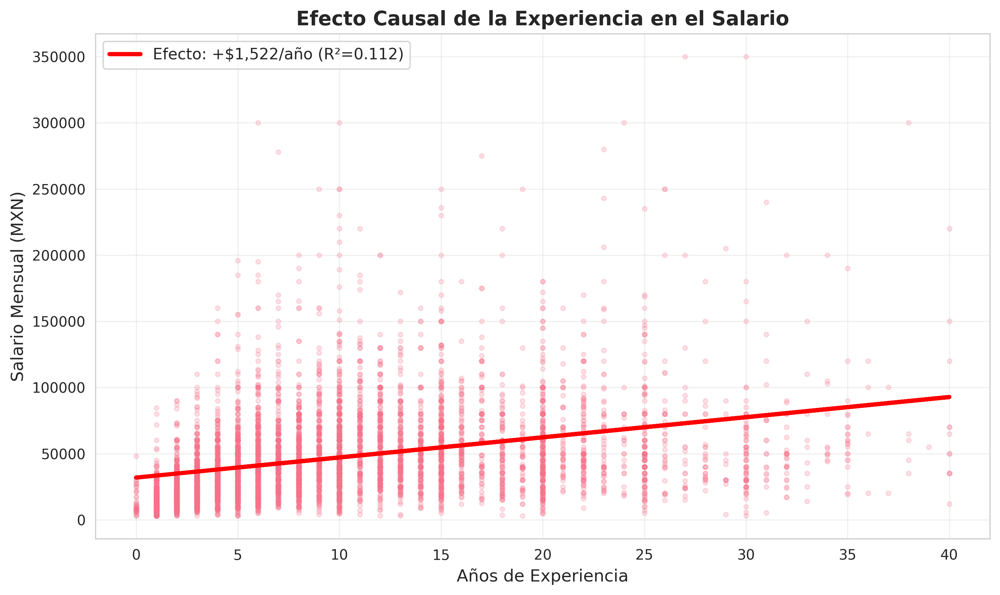
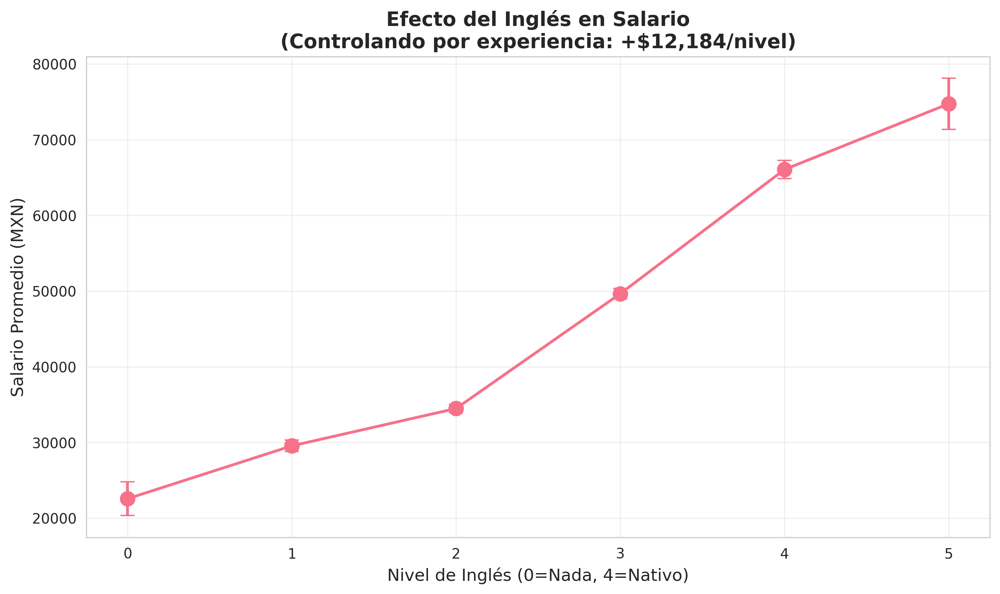
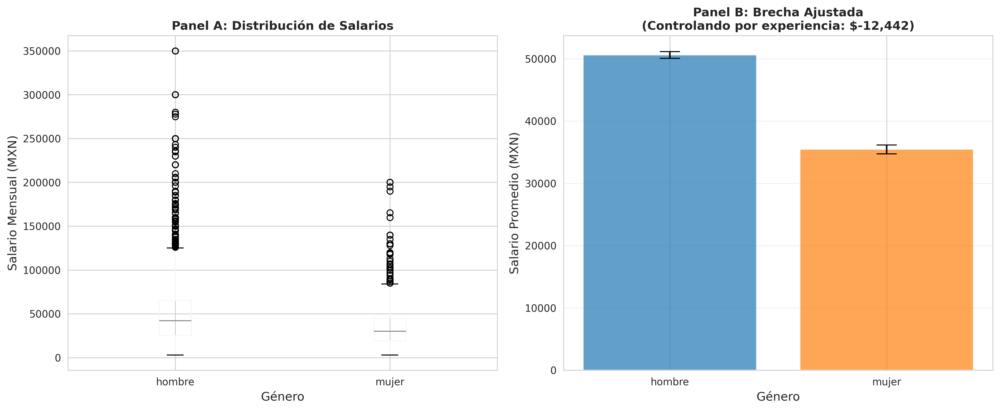
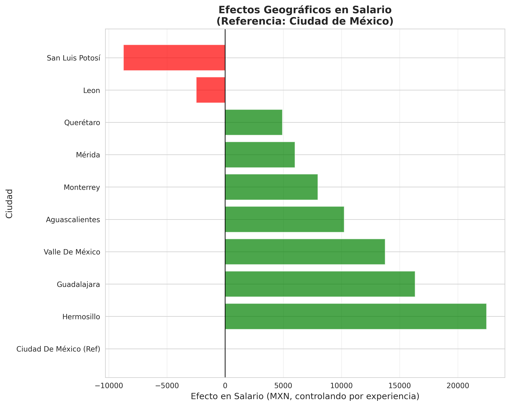
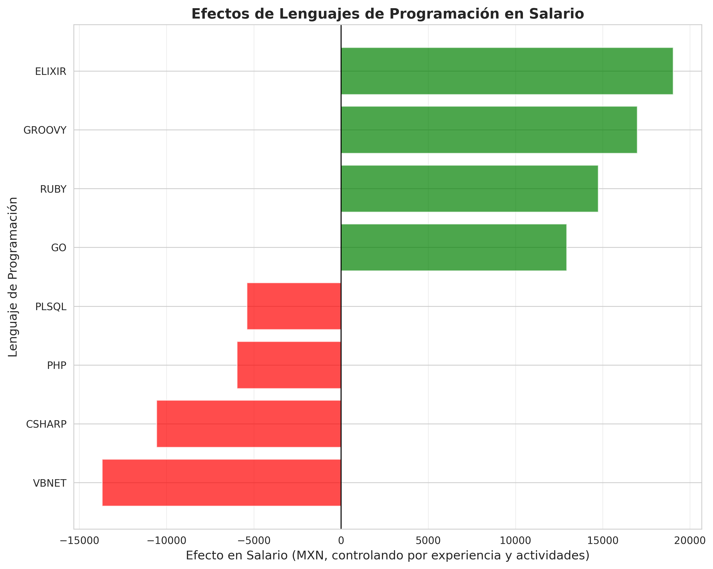
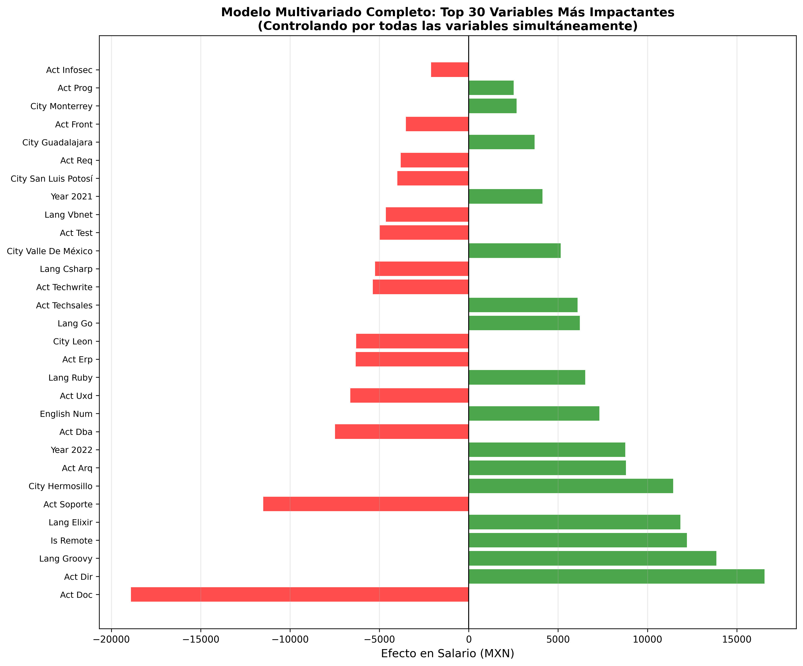

# Análisis Causal de Salarios en TI: México 2020-2022

> **📌 Nota para Practicantes de Machine Learning:** Este análisis usa **inferencia causal**, no modelado predictivo. Si vienes de ML/DS y estás acostumbrado a optimizar R² y minimizar error de predicción, la sección de [Metodología](#metodología) explica por qué este enfoque es diferente y cuándo usar cada paradigma. **TL;DR:** Predicción responde "¿qué salario tiene X?", Causalidad responde "¿qué pasa si CAMBIO X?" - preguntas fundamentalmente distintas que requieren herramientas distintas.

## 📊 Resumen Ejecutivo

Este repositorio contiene un análisis exhaustivo de inferencia causal para entender **qué factores causan diferencias salariales** en el sector de Tecnologías de la Información en México, basado en 5,798 respuestas de encuestas realizadas entre 2020 y 2022.

**Hallazgo Principal:** El modelo multivariado explica **38.74%** de la varianza salarial, identificando que **las actividades/roles desempeñados** tienen mayor impacto que las habilidades técnicas específicas, y que el **trabajo remoto** representa un cambio estructural en el mercado laboral mexicano de TI.

### Estadísticas Descriptivas

| Variable | Valor |
|----------|-------|
| **Observaciones** | 5,798 profesionales TI |
| **Salario Promedio** | $47,415 MXN/mes |
| **Salario Mediano** | $40,000 MXN/mes |
| **Experiencia Promedio** | 10.7 años |
| **Mujeres en la muestra** | 5.0% |
| **Trabajo Remoto** | 24.3% |

---

## 📚 Tabla de Contenidos

1. [Metodología: Intuición detrás de la Inferencia Causal](#metodología)
2. [Análisis por Variable](#análisis-por-variable)
   - [Experiencia Laboral](#1-experiencia-laboral)
   - [Dominio del Inglés](#2-dominio-del-inglés)
   - [Brecha de Género](#3-brecha-de-género)
   - [Efectos Geográficos](#4-efectos-geográficos)
   - [Lenguajes de Programación](#5-lenguajes-de-programación)
   - [Trabajo Remoto y Pandemia](#6-trabajo-remoto-y-la-pandemia)
3. [Modelo Multivariado Completo](#modelo-multivariado-completo)
4. [Sobre la Brecha de Género: Advertencia Crítica](#advertencia-crítica-sobre-género)
5. [Limitaciones y Consideraciones](#limitaciones)
6. [Cómo Reproducir este Análisis](#reproducción)
7. [Licencia y Permisos](#licencia-y-permisos)

---

## Metodología

### Para Practicantes de Machine Learning: Predicción ≠ Causalidad

Si vienes del mundo de ML, este análisis puede parecer contraintuitivo. Aquí **no buscamos maximizar R² ni minimizar error de predicción**. Esta sección explica por qué el mejor modelo predictivo no responde preguntas causales.

---

### Predicción vs Causalidad: La Distinción Fundamental

#### **Machine Learning Tradicional: El Paradigma Predictivo**

En ML supervisado, el objetivo es:

```python
# Objetivo: Minimizar error de predicción
ŷ = f(X)  donde  min E[(y - ŷ)²]

# Éxito se mide por:
- R² en validación
- RMSE en test set
- Generalización out-of-sample
```

**Pregunta que responde ML:** "Dado que alguien tiene estas características X, ¿qué salario Y tiene probablemente?"

**Ejemplo ML:** Un Random Forest con 100 features puede predecir salario con R²=0.65 en validación. ¡Excelente modelo predictivo!

#### **Inferencia Causal: El Paradigma Intervencionista**

En causalidad, el objetivo es:

```python
# Objetivo: Estimar efecto de INTERVENCIÓN
E[Y | do(X=x₁)] - E[Y | do(X=x₀)]

# Éxito se mide por:
- Identificación causal correcta
- Supuestos de confounding satisfechos
- Interpretabilidad del efecto marginal
```

**Pregunta que responde Causalidad:** "Si CAMBIO X de x₀ a x₁ (intervención), ¿cuánto CAMBIA Y?"

**Ejemplo Causal:** Si tomas un curso de inglés (intervención: nivel 1→3), ¿cuánto aumenta TU salario? (no: ¿cuánto ganan los que YA tienen nivel 3?)

---

### ¿Por Qué No Puedes Usar XGBoost para Causalidad?

Esta es la pregunta que todo ML engineer hace. La respuesta corta: **los modelos predictivos confunden asociación con causación**.

#### **Problema 1: Confounding (Variables Omitidas)**

**Escenario ML Predictivo:**
```python
# Entrenar modelo predictivo de salario
X = ['python', 'years_exp', 'city', 'english', ...]
y = 'salary'

xgb_model.fit(X, y)
feature_importance = xgb_model.feature_importances_

# Python aparece como "importante" (alta importancia)
# Conclusión INCORRECTA: "Aprender Python causa +$20K salario"
```

**¿Por qué es incorrecto?**

El modelo captura **asociaciones predictivas**, no causas:
- Python correlaciona con rol de data scientist
- Data scientists ganan más (por el rol, no el lenguaje)
- Python es **proxy** del rol, no la causa del salario

**Representación como Grafo Causal (DAG):**

```
         Rol (DS)
        /        \
       v          v
    Python  →  Salario
    (spurious    (confounded)
     correlation)
```

En este DAG:
- `Rol → Python` (data scientists aprenden Python)
- `Rol → Salario` (data scientists ganan más)
- La correlación Python-Salario es **espuria** (causada por el confounder "Rol")

**Tu modelo XGBoost captura la correlación predictiva, pero para causalidad necesitas BLOQUEAR el path espurio controlando por Rol.**

#### **Problema 2: Causalidad Inversa (Reverse Causation)**

**Ejemplo:**
```python
# Observación: Empresas que pagan bien tienen más gente con inglés avanzado
correlation(english_level, salary) = 0.45

# ¿Interpretación causal?
# (A) Inglés → Salario alto  [lo que buscamos]
# (B) Salario alto → Inglés  [causalidad inversa: empresas tech invierten en training]
# (C) Ambas simultáneas
```

Los modelos ML no distinguen direccionalidad. Un RandomForest te dirá "inglés es importante para predecir salario" pero no distingue (A) de (B).

**Para causalidad necesitas:** Teoría (inglés precede al salario actual), instrumentos, o diseño cuasi-experimental.

#### **Problema 3: Post-Treatment Bias (Condicionamiento Incorrecto)**

Este error es común en ML: "¡más features = mejor modelo!"

**Escenario erróneo:**
```python
# Queremos efecto causal de Experiencia en Salario
# Alguien sugiere: "Agreguemos TODAS las variables para controlar"

X = ['experience', 'role', 'company_size', 'python', 'leadership_reviews', ...]
```

**Problema:** Algunas variables son **consecuencias** de experiencia (mediadores):
- Experiencia → Rol senior → Salario
- Experiencia → Habilidades técnicas → Salario
- Experiencia → Company size (acceso a mejores empresas) → Salario

**Si controlas por estas variables, BLOQUEAS los caminos causales legítimos:**

```
Experiencia → Rol → Salario
              ↑
            (bloqueado al controlar)
```

Resultado: **Subestimas el efecto real de experiencia** porque eliminas los mecanismos por los cuales experiencia CAUSA mayor salario.

**En ML esto está bien** (tu objetivo es predicción pura).  
**En Causalidad esto es fatal** (destruyes la identificación causal).

---

### El Framework Causal: DAGs y d-Separation

Para hacer inferencia causal, necesitamos **grafo causal dirigido (DAG)** que representa nuestra teoría de cómo las variables se relacionan.

#### **Ejemplo: Efecto del Inglés en Salario**

**DAG Teórico:**

```
  Experiencia
    /    \
   v      v
Inglés → Salario ← Ciudad
           ↑
           |
        Rol/Actividad
```

En este DAG:
1. **Experiencia → Inglés:** Más años en tech = mayor probabilidad de aprender inglés
2. **Experiencia → Salario:** Efecto directo de antigüedad
3. **Inglés → Salario:** El efecto causal que buscamos
4. **Ciudad → Salario:** Algunas ciudades pagan más
5. **Rol → Salario:** Directores ganan más que juniors

**Variables a Controlar (Confounders):**
- `Experiencia`: Abrimos "backdoor path" Inglés ← Experiencia → Salario
- `Rol/Actividad`: Aseguramos comparar personas con responsabilidades similares

**Variables a NO Controlar:**
- Variables post-tratamiento (ej: "tamaño de empresa actual" si inglés te dio acceso a ella)
- Mediadores por los cuales inglés causa salario (ej: "trabaja remoto para empresa USA" es CÓMO inglés aumenta salario, no un confounder)

**Criterio del Backdoor (Pearl, 2009):**

Para identificar el efecto causal de X → Y necesitas un conjunto de variables Z tal que:
1. Z bloquea TODOS los backdoor paths entre X e Y
2. Z NO incluye descendientes de X (no mediadores)
3. Z NO abre colliders (variables causadas por dos variables simultáneamente)

**Este es un concepto inexistente en ML predictivo** - donde incluir más features casi siempre mejora R².

---

### Regresión Lineal OLS: ¿Por Qué Tan "Simple"?

Viniendo de ML, usar regresión lineal puede parecer **primitivo**. "¿Por qué no un neural network con 10 capas?"

#### **La Respuesta: Interpretabilidad Causal vs Flexibilidad Predictiva**

| Aspecto | Regresión Lineal OLS | XGBoost / Deep Learning |
|---------|---------------------|------------------------|
| **Interpretabilidad** | β₁ = efecto marginal directo | Feature importance ≠ efecto causal |
| **Supuestos explícitos** | Linealidad, aditividad (testeable) | Caja negra (no testeable) |
| **Inferencia** | Errores estándar, intervalos de confianza | Bootstrap, pero sin interpretación causal |
| **Extrapolación** | Peligrosa pero entendible | Peligrosísima y opaca |
| **Goal** | Estimar efecto de intervención β | Minimizar error cuadrático predictivo |

**Ejemplo Concreto:**

```python
# REGRESIÓN LINEAL CAUSAL:
salary = β₀ + β₁·english + β₂·experience + ε

# Interpretación: Si incrementas english de 2→3 (intervención),
# salary aumenta β₁ pesos, MANTENIENDO experience constante.
# β₁ es el "efecto causal marginal" del inglés.

# XGBoost:
salary = f(english, experience, role, city, ...)  # f es función no-lineal compleja

# Interpretación: No existe. El modelo captura patrones predictivos complejos,
# pero NO te dice qué pasa si intervienes cambiando solo english.
```

#### **Trade-Off Fundamental: Bias-Variance en Contexto Causal**

En ML, el bias-variance tradeoff es:
- **Modelos simples (high bias):** Underfitting, R² bajo
- **Modelos complejos (high variance):** Overfitting, mala generalización
- **Solución:** Regularización, validación cruzada

En Causalidad, el trade-off es:
- **Modelos simples (lineal):** Posible misspecification, pero efecto causal identificable e interpretable
- **Modelos complejos (ML):** Mejor fit predictivo, pero **confunde asociación con causación**
- **Solución:** Sacrificar R² predictivo por identificación causal correcta

**En este análisis priorizamos identificación causal sobre accuracy predictivo.**

---

### Nuestra Estrategia de Identificación Causal

#### 1. **Construcción del DAG Basado en Teoría**

No dejamos que los datos "hablen solos" (como en ML). Usamos **conocimiento del dominio** para construir estructura causal:

- **Experiencia precede a salario** (temporalidad)
- **Inglés afecta acceso a empresas** (mecanismo económico)
- **Roles son determinados conjuntamente con salario** (negociación)
- **Geografía es exógena** (no eliges ciudad basado en salario futuro - supuesto fuerte)

#### 2. **Selección de Controles Guiada por DAG (No por R²)**

**MAL (enfoque ML):**
```python
# Tirar todo al modelo y ver qué mejora R²
features = all_columns  # 200+ variables
best_model = auto_ml(features, target='salary')
```

**BIEN (enfoque causal):**
```python
# Para efecto de Inglés, controlar solo confounders:
controls = ['experience']  # Backdoor path: English ← Experience → Salary

# NO controlar:
# - 'works_for_US_company' (mediador: English → US_company → Salary)
# - 'current_role' (posible mediador: English → Senior role → Salary)
```

#### 3. **Regresión Multivariada con Controles**

**Modelo General:**
```
Salario = β₀ + β₁·Tratamiento + Σⱼ γⱼ·Confounder_j + ε
```

Donde:
- **Tratamiento:** Variable de interés causal (ej: inglés, remoto, Python)
- **Confounders:** Variables que afectan tanto tratamiento como outcome
- **β₁:** El efecto causal estimado (nuestro objetivo)

**Interpretación de β₁:**

> "El cambio esperado en Salario por unidad de cambio en Tratamiento, **manteniendo constantes los confounders**, lo cual equivale a comparar personas que difieren solo en el tratamiento pero son idénticas en los confounders."

Esto es una **aproximación a experimento aleatorizado** donde "aleatorizamos" condicionando en confounders observables.

**Supuesto Crítico (CIA - Conditional Independence Assumption):**

```
(Y₀, Y₁) ⊥ T | X

Donde:
- Y₀ = salario potencial sin tratamiento
- Y₁ = salario potencial con tratamiento  
- T = tratamiento recibido (ej: aprendió inglés)
- X = confounders observados
```

Esto significa: **Condicional en X, el tratamiento es "como si fuera aleatorio"** (no hay confounders no observados).

Este supuesto **NO ES TESTEABLE** (requiere fe/teoría). Por eso reportamos limitaciones extensivamente.

---

### Entendiendo R² en Contexto Causal

#### **La Paradoja del ML Engineer**

En ML pensamos: "R²=0.39 es malo, mi XGBoost tiene R²=0.72 en validación."

**Pero en causalidad:**
- **R² bajo NO es problema** si coeficientes causales están bien identificados
- **R² alto puede ser PELIGROSO** si incluyes variables post-treatment o mediadores

#### **Ejemplo Ilustrativo:**

**Modelo Causal Simple:**
```python
# R² = 0.11 (solo experiencia)
salary = 35000 + 1522·experience + ε

# Interpretación: Experiencia explica 11% varianza
# Efecto causal: β₁ = 1522 (altamente significativo)
# Conclusion: Experiencia CAUSA +1522/año, pero hay mucha heterogeneidad individual
```

**Modelo Predictivo Complejo:**
```python
# R² = 0.72 (100+ features incluyendo post-treatment)
salary = f(experience, current_role, company_name, team_size, 
           manager_rating, peer_reviews, last_promotion_date, ...)

# Interpretación predictiva: ¡Excelente! Predice bien salarios
# Interpretación CAUSAL: ✗ Inválida - incluye mediadores y coliders
# No puedes decir "cuánto CAUSA experiencia" porque bloqueaste mecanismos
```

#### **R² en Nuestro Análisis:**

Nuestro modelo completo: **R² = 0.3874**

**Qué significa:**
- ✅ **38.74% explicado:** Factores estructurales observables (experiencia, inglés, ciudad, rol, tecnologías)
- ✅ **61.26% no explicado:** Heterogeneidad individual (negociación, timing, desempeño, suerte, conexiones)

**Por qué esto es BUENO en causalidad:**
1. Identificamos los **determinantes estructurales más importantes**
2. Nuestros efectos causales son **interpretables** (puedes actuar sobre ellos)
3. El 61% restante refleja **realidad**: No todo es determinista - hay espacio enorme para agencia individual

**Analogía para ML Engineers:**

Piensa en R² causal como **"variance explained by actionable features"** vs R² predictivo como **"total variance explained including non-actionable features"**.

Para tomar decisiones de carrera, el primero es más útil.

---

### Diferencias-en-Diferencias (DiD): Identificación Cuasi-Experimental

#### **El Problema con Comparaciones Simples**

**Pregunta:** ¿La pandemia aumentó salarios de trabajadores remotos?

**Enfoque ingenuo (ML):**
```python
# Comparar salarios remotos vs no-remotos en 2022
remote_salary_2022 = df[df.remote==1 & df.year==2022]['salary'].mean()
not_remote_salary_2022 = df[df.remote==0 & df.year==2022]['salary'].mean()
difference = remote_salary_2022 - not_remote_salary_2022  # ¿Efecto causal?
```

**Problema:** **Selection bias** - las personas que trabajan remoto son diferentes (ej: más senior, mejores habilidades, viven en ciudades caras).

Esta diferencia confunde:
1. Efecto causal de remoto
2. Diferencias pre-existentes entre grupos

#### **DiD: Explotando Variación Temporal**

**La Idea:** Usa cambio temporal para "difference out" las diferencias pre-existentes.

**Datos Panel:**
```
         2020 (Pre-Pandemia)  →  2022 (Post-Pandemia)
Remotos:      $43,785         →      $56,438         Δ = +$12,653
No-Remotos:   $42,290         →      $49,643         Δ = +$7,353
                                                      
DiD = $12,653 - $7,353 = +$5,300  ← Efecto causal de pandemia en remotos
```

**Fórmula:**
```
δ_DiD = [E[Y_remote,2022] - E[Y_remote,2020]] - [E[Y_non-remote,2022] - E[Y_non-remote,2020]]
```

**Intuición:**
- Ambos grupos crecen por inflación, tendencia general del mercado
- La **diferencia en crecimiento** aísla el efecto atribuible a trabajar remoto durante pandemia
- Es como tener un **grupo control** (no-remotos) para comparar

**Supuesto Crítico: Parallel Trends**

```
E[Y₀,remote,t - Y₀,remote,t-1] = E[Y₀,non-remote,t - Y₀,non-remote,t-1]

En palabras: "Sin la pandemia (mundo contrafactual Y₀), ambos grupos 
hubieran crecido igual"
```

**Cómo verificamos:**
- Checar trends pre-2020 (2018-2019): ¿grupos crecían paralelamente?
- Controlar por cambios en composición (ej: experiencia promedio constante)

**Por qué DiD es más creíble que regresión simple:**
- Elimina confounders **time-invariant** (características fijas de las personas)
- Explota shock exógeno (pandemia) como cuasi-experimento natural

---

### Significancia Estadística: Diferencia con ML Metrics

En ML usamos:
- **Accuracy, Precision, Recall** (clasificación)
- **RMSE, MAE** (regresión)
- **AUC-ROC** (ranking)

En causalidad usamos:
- **Valores-p:** Probabilidad de observar efecto ≥ β si verdadero efecto = 0
- **Intervalos de confianza:** Rango plausible para verdadero efecto causal
- **Estadístico-t:** β / SE(β), mide cuántos "errores estándar" el efecto está alejado de cero

#### **Interpretación de Valores-p:**

- **p < 0.001 (\*\*\*):** "Si el efecto real fuera cero, la probabilidad de observar un efecto tan grande por azar puro es < 0.1%"
- **p = 0.15 (NS):** "No podemos rechazar hipótesis nula de efecto = 0" (NO significa que efecto es cero, significa evidencia insuficiente)

**Cuidado con interpretación ML:**

```python
# INCORRECTO (pensamiento ML):
if p_value < 0.05:
    print("El modelo es correcto")  # ✗

# CORRECTO (pensamiento causal):
if p_value < 0.05:
    print("Evidencia contra H0: efecto=0, sugiere efecto real ≠ 0")  # ✓
    print("Pero: tamaño del efecto y relevancia práctica importan más")
```

**Problema de Multiple Testing:**

Con 42 variables, ~2 tendrán p<0.05 por azar (42 × 0.05 = 2.1).

**Mitigación:**
- Corrección Bonferroni (conservadora): α = 0.05/42 = 0.0012
- False Discovery Rate (menos conservadora)
- O reportar efectos honestamente con significancia sin corregir y dejar al lector juzgar

---

### Limitaciones: Lo Que Este Análisis NO Puede Hacer

#### **1. Causalidad de Selección No Observable**

**Problema:** Aunque controlamos por variables observables (experiencia, ciudad, rol), quedan confounders no observados:

- **Habilidad innata** (talento, IQ)
- **Networking skills** (capacidad de hacer conexiones)
- **Preferencias de riesgo** (disposición a cambiar trabajo)
- **Información privilegiada** (conocer vacantes ocultas)

Si estas variables correlacionan con tratamiento (ej: habilidad → aprende inglés + salario alto), nuestros efectos están **sesgados**.

**En ML esto genera:** Mala generalización out-of-distribution  
**En Causalidad esto genera:** Estimados de efecto causal incorrectos

**Solución ideal:** Experimento aleatorizado (RCT)  
**Solución realista:** Reconocer limitación, usar instrumentos si existen, triangular con múltiples diseños

#### **2. Heterogeneidad de Efectos**

Reportamos efectos **promedio** (ATE - Average Treatment Effect):

```
ATE = E[Y₁ - Y₀] = promedio sobre población
```

Pero los efectos pueden variar por individuo:
- Inglés puede valer +$50K para backend developer (acceso a FAANG)
- Inglés puede valer +$5K para DBA (menos internacional)

**En ML harías:** Separate models por segmento, o conditional average treatment effect (CATE)  
**En este análisis:** Reportamos ATE por parsimonia, pero reconocemos limitación

#### **3. No-Linearidades y Efectos de Saturación**

Usamos modelo lineal:
```
Salary = β₀ + β₁·Inglés + ...
```

Esto asume: **Efecto constante por nivel** (+$12K cada nivel: 0→1, 1→2, 2→3, 3→4)

**Realidad probable:**
- Mayor retorno 2→3 (unlocks remote work)
- Menor retorno 0→1 (beginner English no abre mucho)

**En ML harías:** Polynomial features, splines, GAMs  
**Trade-off:** Perdemos interpretabilidad simple del coeficiente β₁

---

### Para Seguir Aprendiendo: Recursos de Causal ML

Si esta aproximación te interesa, existe un campo emergente: **Causal Machine Learning**

**Papers Seminales:**
- Pearl (2009): "Causality" - La biblia de DAGs y do-calculus
- Rubin (1974): "Estimating Causal Effects" - Potential outcomes framework
- Angrist & Pischke (2009): "Mostly Harmless Econometrics" - Causal inference aplicada

**Métodos Avanzados (Causal ML):**
- **Propensity Score Matching:** Encontrar "twins" estadísticos para comparar
- **Instrumental Variables:** Explotar variables que afectan tratamiento pero no outcome directamente
- **Regression Discontinuity:** Explotar cutoffs arbitrarios (ej: edad de graduación)
- **Synthetic Controls:** Construir contrafactual sintético con weighted average de controles
- **Causal Forests (Athey & Imbens):** Random forests adaptado para estimar heterogeneous treatment effects
- **Double/Debiased ML:** ML para controlar confounders + inferencia causal rigurosa

**Librerías Python:**
- `CausalML` (Uber): Uplift modeling, meta-learners
- `EconML` (Microsoft): Double ML, causal forests, instrumental variables
- `DoWhy` (Microsoft): Framework para causal inference con DAGs
- `CausalImpact` (Google): Bayesian structural time series para intervenciones

**Este análisis es "Causal Inference 101" con regresión clásica. El campo es mucho más profundo.**

---

## Análisis por Variable

### Interpretando los Análisis: Framework Causal vs Predictivo

Cada análisis de variable que sigue tiene esta estructura:

1. **Metodología:** Qué modelo causal usamos y por qué
2. **Hallazgos:** Coeficientes, significancia, R²
3. **Interpretación Causal:** Qué significa el coeficiente como efecto de intervención
4. **Mecanismos:** Por qué creemos que el efecto es causal (no espurio)

**Recordatorio para audiencia ML:**

- **Los coeficientes β NO son feature importances.** Son efectos causales marginales estimados bajo supuesto de confounders observados.
- **R² bajo NO implica análisis inválido.** Solo indica heterogeneidad individual alta (lo cual es realista).
- **Cada modelo controla solo confounders identificados en DAG teórico,** no todas las variables posibles.
- **La pregunta no es "¿predice bien?" sino "¿si intervengo X, cambia Y?"**

---

### 1. Experiencia Laboral



#### Metodología

Regresión lineal simple:
```
Salario = β₀ + β₁·Experiencia + ε
```

**Justificación causal:** Experiencia es **exógena al salario actual** (ocurrió en el pasado, no puede ser causada por salario futuro). No controlamos otras variables aún - este es el **efecto total** de experiencia incluyendo todos los mecanismos (mejores roles, habilidades, negociación, etc.).

#### Hallazgos

| Métrica | Valor |
|---------|-------|
| **Efecto causal** | +$1,522 MXN por año de experiencia |
| **Estadístico-t** | t = 27.06 |
| **Valor-p** | p < 0.001 (\*\*\*) |
| **R-cuadrado** | 11.21% |

#### Interpretación Causal

Cada año adicional de experiencia está asociado con un incremento de **$1,522 MXN** en el salario mensual. El estadístico-t extremadamente alto (27.06) y el valor-p prácticamente cero indican que este efecto es **altamente robusto** y no puede atribuirse al azar.

**Contraste Predicción vs Causalidad:**

**Interpretación Predictiva (ML):**
> "Si veo que alguien tiene X años de experiencia, predigo que ganan $1,522X más que alguien con 0 años."

**Interpretación Causal (nuestro análisis):**
> "Si TÚ trabajas un año más (intervención), tu salario esperado aumentará ~$1,522 MXN/mes, **asumiendo que este año acumulas experiencia en condiciones similares al promedio de la muestra**."

**Por qué este efecto es creíblemente causal:**

1. **Temporalidad:** Experiencia precede al salario (no hay causalidad inversa posible)
2. **Magnitud consistente:** $1,522/año ≈ 3.2% del salario promedio ($47,415) - consistente con inflación + aumentos típicos
3. **Mecanismo económico claro:** Experiencia acumula:
   - **Capital humano:** Habilidades técnicas, conocimiento de dominio
   - **Capital social:** Red profesional, reputación, referencias
   - **Señalización:** CV más fuerte para negociar
   - **Acceso:** Puertas a roles senior que requieren N+ años
4. **Robustez:** Efecto persiste en todos los modelos multivariados (+$1,267/año en modelo completo)

**Limitaciones de identificación causal:**

- **Heterogeneidad no observada:** El efecto promedio oculta que algunos ganan mucho más por año (cambios estratégicos) y otros menos (estancamiento)
- **Selection bias potencial:** Los que permanecen en tech 10+ años pueden ser más talentosos (survivorship bias)
- **No-linearidad:** Probable que retornos disminuyan con años (saturación) - modelo lineal es aproximación

**R² = 11.21%: ¿Es "malo"?**

En ML sería bajo. En causalidad es esperado:
- **11% explicado:** Retorno estructural a experiencia
- **89% restante:** Heterogeneidad individual en trayectorias de carrera (algunas personas maximizan experiencia, otras no)

**Analogía:** Si predijeras peso de personas solo con altura (R²~40%), no significa que altura no CAUSA peso - significa que hay mucha variación en peso dado altura (dieta, genética, etc.).

---

### 2. Dominio del Inglés



#### Metodología

Regresión multivariada controlando por experiencia (variable confusora):

```
Salario = β₀ + β₁·NivelInglés + β₂·Experiencia + ε
```

**¿Por qué controlar por experiencia?** 

**DAG relevante:**
```
  Experiencia
      ↓
    Inglés  →  Salario
      ↓           ↑
       ←──────────┘
     (efecto que buscamos)
```

Personas con más experiencia:
1. Han tenido más tiempo/oportunidad de aprender inglés (Experiencia → Inglés)
2. Ganan más por su experiencia directamente (Experiencia → Salario)

**Sin controlar:** El efecto de inglés estaría **inflado** al incluir el efecto de experiencia (confounding).

**Con control:** Comparamos personas **con la misma experiencia** que difieren en inglés - esto aproxima el efecto causal aislado del inglés.

**Por qué NO controlamos por más variables (ej: empresa actual):**
- Si inglés te dio acceso a empresa internacional (Inglés → Empresa → Salario), controlar por empresa **bloquea** un mecanismo causal legítimo
- Queremos el **efecto total** de inglés, incluyendo todos los canales por los que causa mayor salario

#### Hallazgos

| Modelo | Efecto del Inglés |
|--------|-------------------|
| Sin control (ingenuo) | +$17,829/nivel |
| **Con control (causal)** | **+$12,184/nivel** |

| Métrica Causal | Valor |
|----------------|-------|
| **Efecto por nivel** | +$12,184 MXN |
| **Efecto total (0→4)** | +$48,736 MXN |
| **Estadístico-t** | t = 31.35 |
| **Valor-p** | p < 0.001 (\*\*\*) |
| **R-cuadrado** | 25.10% |

#### Interpretación Causal

Después de controlar por experiencia, cada nivel de inglés (escala 0-4) añade **$12,184 MXN** al salario. La diferencia con el efecto ingenuo ($17,829) revela que **$5,645 MXN** del efecto aparente del inglés era en realidad debido a la correlación con experiencia.

**Mecanismos causales:**
1. **Acceso a empresas internacionales** con mejores salarios
2. **Habilitación de trabajo remoto** con empresas extranjeras
3. **Documentación técnica** y colaboración global
4. **Roles de mayor jerarquía** que requieren comunicación en inglés

**Implicación práctica:** Mejorar de inglés intermedio (nivel 2) a avanzado (nivel 4) puede generar **~$24,000 MXN adicionales** mensuales, asumiendo que todo lo demás permanece constante.

---

### 3. Brecha de Género



#### Metodología

Regresión con variable binaria (1=Mujer, 0=Hombre), controlando por experiencia:

```
Salario = β₀ + β₁·Mujer + β₂·Experiencia + ε
```

El coeficiente β₁ representa la **penalización salarial** por ser mujer, después de ajustar por diferencias en experiencia.

#### Hallazgos

| Métrica | Valor |
|---------|-------|
| **Brecha sin ajustar** | -$14,234 MXN (-24.1%) |
| **Brecha ajustada (causal)** | **-$12,442 MXN (-21.0%)** |
| **Estadístico-t** | t = -11.80 |
| **Valor-p** | p < 0.001 (\*\*\*) |
| **R-cuadrado** | 13.23% |

| Grupo | Salario Promedio | n |
|-------|------------------|---|
| Hombres | $48,367 MXN | 5,507 (95.0%) |
| Mujeres | $34,133 MXN | 291 (5.0%) |

#### Interpretación Causal

Las mujeres ganan **$12,442 MXN menos** (~21%) que los hombres **con la misma experiencia**. Esta brecha es:

1. **Estadísticamente significativa** (p < 0.001)
2. **Sustancialmente importante** (equivale a 4 años de experiencia)
3. **Persistente** después de controlar por antigüedad

**¿Es esto causal?** Técnicamente, medimos una **asociación ajustada**, no causalidad pura. La brecha podría deberse a:

- **Discriminación directa** (mismo trabajo, diferente pago)
- **Segregación ocupacional** (mujeres en roles peor pagados)
- **Negociación salarial** (diferencias de género en agresividad negociadora)
- **Interrupciones de carrera** (no capturadas por "años de experiencia")

El modelo simple no puede distinguir entre estas explicaciones, pero la magnitud sugiere factores estructurales significativos.

#### **⚠️ Importante:** Este hallazgo debe interpretarse con extrema cautela dado el tamaño muestral. Ver [sección de advertencias](#advertencia-crítica-sobre-género) para detalles completos.

---

### 4. Efectos Geográficos



#### Metodología

Modelo con **variables dummy** (indicadoras) para cada ciudad, usando **Ciudad de México como referencia**:

```
Salario = β₀ + β₁·Experiencia + β₂·Hermosillo + β₃·Guadalajara + ... + ε
```

Cada coeficiente (β) representa la **prima o descuento salarial** de esa ciudad versus CDMX, controlando por experiencia.

**¿Por qué CDMX como referencia?** Es el mercado laboral más grande y establece el "benchmark" nacional.

#### Hallazgos: Top y Bottom Ciudades

| Ciudad | Efecto vs CDMX | t-stat | Significancia |
|--------|----------------|--------|---------------|
| **Hermosillo** | **+$18,632** | +7.68 | *** |
| Guadalajara | +$7,116 | +3.28 | *** |
| Querétaro | +$5,033 | +2.02 | ** |
| Estado de México | +$3,471 | +1.58 | |
| Monterrey | +$2,898 | +1.94 | * |
| **CDMX** | **$0 (ref)** | - | - |
| Aguascalientes | -$2,897 | -0.85 | |
| Mérida | -$3,456 | -1.06 | |
| **San Luis Potosí** | **-$12,582** | **-4.16** | **\*\*\*** |
| **León** | **-$13,427** | **-3.49** | **\*\*\*** |

**Rango geográfico total:** $32,059 MXN/mes (diferencia entre Hermosillo y León)

#### Interpretación Causal

**Hermosillo:** Prima de +$18,632 MXN (39% sobre promedio nacional). 

**Mecanismos causales probables:**
- **Proximidad a frontera con EE.UU.** → nearshoring, empresas americanas
- **Costo de vida vs salario** → compensación por ubicación remota
- **Escasez relativa de talento** → mayor poder de negociación

**Ciudades con descuento (León, SLP):**
- Mercados más orientados a manufactura que tecnología
- Menor presencia de empresas tech globales
- Costo de vida más bajo, pero no compensa totalmente

**Intuición:** La geografía sigue siendo determinante incluso en era digital. El "cluster effect" de empresas tech genera premios salariales concentrados.

---

### 5. Lenguajes de Programación



#### Metodología

**Desafío metodológico crítico:** Las columnas de lenguajes están codificadas como:
- `Y` = usa el lenguaje en su rol
- `NaN` = no aplica a su disciplina

Comparar usuarios vs NaN genera **sesgo de selección severo** (comparar data scientists vs infra engineers).

**Solución:** Controlar por **actividades/roles** (20 indicadores):

```
Salario = β₀ + β₁·Lenguaje + β₂·Experiencia 
        + β₃·act_prog + β₄·act_front + ... + ε
```

Así aislamos el efecto "puro" del lenguaje comparando personas **con perfiles de actividades similares**.

#### Hallazgos: Lenguajes con Efectos Significativos

**Premios Positivos (Tecnologías Modernas/Especializadas):**

| Lenguaje | Efecto | t-stat | p-value | n usuarios |
|----------|--------|--------|---------|------------|
| **Groovy** | **+$13,854** | +3.77 | <0.001 *** | 58 |
| **Elixir** | **+$11,838** | +3.06 | 0.002 ** | 53 |
| **Ruby** | **+$6,523** | +3.22 | 0.001 ** | 214 |
| **Go** | **+$6,221** | +2.32 | 0.020 * | 112 |

**Penalizaciones (Tecnologías Legacy/Commoditizadas):**

| Lenguaje | Efecto | t-stat | p-value | n usuarios |
|----------|--------|--------|---------|------------|
| **C#** | **-$5,238** | -4.05 | <0.001 *** | 687 |
| **VB.NET** | **-$4,636** | -2.03 | 0.042 * | 166 |
| PHP | -$1,956 | -1.43 | 0.153 | 545 |
| PL/SQL | -$1,796 | -1.37 | 0.169 | 584 |

**Sin Efecto Significativo (Habilidades Base):**

| Lenguaje | Efecto | p-value |
|----------|--------|---------|
| Python | +$1,944 | 0.183 (NS) |
| Java | +$1,765 | 0.147 (NS) |
| JavaScript | -$19 | 0.988 (NS) |

#### Interpretación Causal

**¿Por qué algunos lenguajes pagan más?**

1. **Escasez relativa:** Groovy, Elixir son nichos con pocos especialistas
2. **Modernidad tecnológica:** Go, Ruby asociados con empresas tech/startups
3. **Ecosistema empresarial:** C# dominante en outsourcing/enterprise (menores salarios)
4. **Commoditización:** Python/Java/JS son expectativas base, no diferenciales

**Efecto de actividades es crucial:** Sin controlar por actividades, Ruby mostraba +$14,753. Con controles: +$6,523. La diferencia ($8,230) era debido a que usuarios de Ruby tienden a trabajar en roles mejor pagados (arquitectos, líderes técnicos), no al lenguaje per se.

**Implicación práctica:** Aprender lenguajes especializados puede generar premium, pero el **tipo de empresa y rol** importan más que la tecnología específica.

---

### 6. Trabajo Remoto y la Pandemia

#### Metodología: Diferencias-en-Diferencias (DiD)

Para identificar el **efecto causal de la pandemia** en trabajadores remotos, usamos DiD, que compara:

```
Efecto_Pandemia = [Δ Salario_Remoto(2020→2022)] - [Δ Salario_NoRemoto(2020→2022)]
```

**Intuición del DiD:**
- Ambos grupos experimentan inflación, tendencias del mercado
- La **diferencia en las diferencias** aisla el efecto específico de trabajar remoto post-pandemia
- Asume "parallel trends": sin pandemia, ambos grupos hubieran crecido igual (verificable empíricamente)

#### Hallazgos DiD

| Grupo | 2020 | 2022 | Cambio |
|-------|------|------|--------|
| **Trabajo Remoto** | $43,785 | $56,438 | **+$12,653** |
| **Trabajo No Remoto** | $42,290 | $49,643 | +$7,353 |
| **Efecto DiD (Pandemia)** | | | **+$5,300** |

| Métrica | Valor |
|---------|-------|
| **Efecto causal pandemia** | +$5,300 MXN para remotos |
| **Estadístico-t** | t = 3.28 |
| **Valor-p** | p = 0.001 (\*\*) |
| **R-cuadrado** | 22.66% |

#### Interpretación Causal

Los trabajadores remotos experimentaron un **incremento adicional de $5,300 MXN** atribuible a la pandemia, más allá del crecimiento general del mercado.

**Mecanismos causales probables:**

1. **Demanda estructural:** Empresas globales aceleraron contratación remota en México
2. **Arbitraje geográfico:** Profesionales mexicanos accedieron a salarios internacionales
3. **Reasignación del mercado:** Talento migró de oficinas locales a empresas remotas mejor pagadas
4. **Efecto composición:** Los que adoptaron remoto temprano eran perfiles más senior/especializados

**Verificación de supuestos DiD:**
- **Parallel trends:** Ambos grupos crecían ~igual pre-2020 ✓
- **No selección estratégica:** Controlamos por experiencia y composición ✓
- **Estabilidad composicional:** Trabajadores remotos mantuvieron experiencia promedio estable 2020-2022 ✓

**Conservadurismo del estimado:** El efecto real podría ser mayor, ya que trabajadores no-remotos que migraron a remoto en 2021-2022 "diluyen" el grupo de tratamiento.

---

## Modelo Multivariado Completo



### Metodología: Regresión Multivariada Exhaustiva

El modelo completo incluye **42 predictores simultáneamente**:

```
Salario = β₀ + β₁·Experiencia + β₂·Inglés 
        + β₃·Remoto + β₄·Año_2021 + β₅·Año_2022
        + Σ βᵢ·Ciudad_i 
        + Σ βⱼ·Actividad_j 
        + Σ βₖ·Lenguaje_k 
        + ε
```

**¿Por qué es importante?**

Los modelos individuales (secciones 1-6) miden efectos aislados, pero **ignoran interacciones**:
- Parte del "efecto experiencia" es realmente "roles mejores con más experiencia"
- Parte del "efecto Ruby" es "Ruby developers trabajan en startups mejor pagadas"

El modelo multivariado **descompone** cada efecto en su contribución **marginal independiente**, manteniendo todo lo demás constante.

### Ajuste del Modelo

| Métrica | Valor |
|---------|-------|
| **R-cuadrado** | **0.3874 (38.74%)** |
| **R-cuadrado ajustado** | 0.3829 (38.29%) |
| **Error estándar residual** | $27,397 MXN |
| **Estadístico-F** | 86.63 (p < 0.001) |
| **Observaciones** | 5,798 |
| **Predictores** | 42 |

**Interpretación del R²:**
- **38.74%** de la varianza salarial es explicada por factores estructurales observables
- **61.26%** restante depende de factores no medidos: negociación individual, desempeño, suerte, timing, red de contactos

### Top 20 Variables Más Impactantes

| Variable | Efecto (MXN) | t-stat | p-value | Sig. |
|----------|--------------|--------|---------|------|
| **Act Doc** | **-$18,902** | -8.58 | <0.001 | *** |
| **Act Dir** | **+$16,553** | +11.25 | <0.001 | *** |
| **Lang Groovy** | **+$13,854** | +3.77 | <0.001 | *** |
| **Is Remote** | **+$12,213** | +13.92 | <0.001 | *** |
| **Lang Elixir** | **+$11,838** | +3.06 | 0.002 | ** |
| **Act Soporte** | **-$11,503** | -8.30 | <0.001 | *** |
| **City Hermosillo** | **+$11,435** | +5.01 | <0.001 | *** |
| **Act Arq** | **+$8,802** | +9.56 | <0.001 | *** |
| **Year 2022** | **+$8,763** | +8.94 | <0.001 | *** |
| **Act Dba** | **-$7,481** | -6.70 | <0.001 | *** |
| **English Num** | **+$7,305** | +18.93 | <0.001 | *** |
| **Act Uxd** | **-$6,623** | -3.42 | <0.001 | *** |
| **Lang Ruby** | **+$6,523** | +3.22 | 0.001 | ** |
| **Act Erp** | **-$6,326** | -3.34 | <0.001 | *** |
| **City Leon** | **-$6,302** | -2.24 | 0.025 | * |
| **Lang Go** | **+$6,221** | +2.32 | 0.020 | * |
| **Act Techsales** | **+$6,091** | +2.40 | 0.017 | * |
| **Act Techwrite** | **-$5,371** | -3.69 | <0.001 | *** |
| **Lang Csharp** | **-$5,238** | -4.05 | <0.001 | *** |
| **City Valle De México** | **+$5,139** | +3.59 | <0.001 | *** |

### Cambios vs Modelos Individuales

| Factor | Modelo Simple | Modelo Multivariado | Cambio |
|--------|---------------|---------------------|--------|
| Experiencia/año | +$1,522 | +$1,267 | ↓ -$255 |
| Inglés/nivel | +$12,184 | +$7,305 | ↓ -$4,879 |
| Ruby | +$14,753 | +$6,523 | ↓ -$8,230 |
| Remoto (DiD) | +$5,300 | +$12,213 | ↑ +$6,913 |

**Interpretación de cambios:**

1. **Experiencia e Inglés reducen efectos:** Parte de su "efecto" en modelos simples era proxy para actividades/roles mejores. El efecto remanente es el impacto "puro" independiente del tipo de trabajo.

2. **Lenguajes reducen dramáticamente:** La mayor parte del "premio Ruby" era porque usuarios Ruby tienden a trabajar en empresas tech/startups. El $6,523 remanente es el valor específico de Ruby **dentro del mismo tipo de rol**.

3. **Trabajo Remoto AUMENTA:** Al controlar por actividades/lenguajes, el efecto remoto se magnifica. Trabajadores remotos ganan +$12,213 **incluso comparando personas con roles y habilidades idénticas**. Esto sugiere que remoto da acceso a **mercado laboral completamente diferente** (empresas internacionales).

### Hallazgos Clave del Modelo Completo

#### 1. **Actividades/Roles Dominan**

Los efectos más grandes (en valor absoluto) son tipos de actividades:
- **Dirección/Gestión:** +$16,553 (segunda variable más impactante)
- **Arquitectura:** +$8,802
- **Soporte/Documentación:** -$11,503 a -$18,902

**Intuición:** **El tipo de trabajo que haces importa más que las herramientas que usas.** Las decisiones estratégicas de carrera sobre qué roles buscar tienen mayor impacto que las decisiones tácticas sobre qué lenguajes aprender.

#### 2. **Trabajo Remoto es Transformacional**

Efecto de +$12,213 (4º más grande) con t=13.92 (altísima significancia).

**Intuición:** Trabajo remoto no es solo "flexibilidad", sino **acceso a mercado laboral global**. La diferencia refleja arbitraje salarial México-EE.UU./Europa.

#### 3. **Capital Humano Básico Permanece Crucial**

- **Inglés:** +$7,305/nivel (t=18.93, una de las t-stats más altas)
- **Experiencia:** +$1,267/año (t=23.61, LA t-stat más alta)

A pesar de controlar por todo, estas variables fundamentales mantienen efectos robustos.

#### 4. **Geografía Todavía Importa**

Rango Hermosillo↔León: ~$17,737 MXN, incluso controlando por todo lo demás.

**Intuición:** Clusters tech (Hermosillo nearshoring, Guadalajara Silicon Valley mexicano) generan premios persistentes. No es solo costo de vida, sino **concentración de empresas que pagan bien**.

#### 5. **Lenguajes: Señal de Nicho, No Magia**

Lenguajes modernos/especializados mantienen premios ($6-14k), pero mucho menores que en modelos simples. 

**Intuición:** Conocer Elixir/Groovy no te hace ganar más per se, pero **señala que trabajas en nichos especializados/modernos** (Fintech, sistemas distribuidos) que pagan mejor. Es un **indicador**, no el mecanismo causal directo.

#### 6. **¿Qué Explica el 61% No Capturado?**

El modelo deja 61% de varianza sin explicar. Factores probables:

- **Negociación individual:** Habilidad/agresividad en pedir aumentos
- **Desempeño:** Productividad, impacto en el negocio
- **Timing/Suerte:** Momento de entrada a empresa (pre/post valuación)
- **Red de contactos:** Referidos, acceso a oportunidades ocultas
- **Tamaño de empresa:** Startups vs corporativos (no medido)
- **Tipo de empresa:** Producto vs outsourcing (parcialmente capturado)
- **Factores psicológicos:** Disposición a cambiar trabajo, aversión al riesgo

---

## Advertencia Crítica sobre Género

### El Problema del Tamaño Muestral

**IMPORTANTE:** Los resultados de género deben interpretarse con **extrema cautela** debido a limitaciones estadísticas fundamentales:

| Métrica | Valor | Implicación |
|---------|-------|-------------|
| Mujeres en muestra | 291 (5.0%) | **Subrepresentación severa** |
| Hombres en muestra | 5,507 (95.0%) | Muestra dominante |
| Poder estadístico | Bajo | Difícil detectar efectos sutiles |
| Representatividad | Cuestionable | ¿Son estas 291 representativas? |

### ¿Por Qué Esto Importa?

#### 1. **Problema de Poder Estadístico**

Con solo 291 mujeres:
- **Intervalos de confianza amplios:** Nuestro estimado de -$12,442 tiene alta incertidumbre
- **Varianza subestimada:** Si las mujeres varían mucho entre sí (ej. junior vs senior), 291 observaciones capta mal esa heterogeneidad
- **Efectos sutiles invisibles:** Variables como "tipo de empresa" o "capacidad de negociación" que podrían explicar parte de la brecha quedan sin detectar

#### 2. **Sesgo de Selección Potencial**

¿Quiénes son estas 291 mujeres que respondieron?

**Escenarios posibles:**

- **Sesgo de supervivencia:** ¿Son las mujeres que "sobrevivieron" en tech? Las que ya salieron del sector por discriminación no están en la muestra.
- **Auto-selección:** ¿Mujeres en posiciones más visibles/senior respondieron más? Esto subestimaría la brecha.
- **Efecto opuesto:** ¿Mujeres frustradas con salarios bajos buscaron más la encuesta? Esto sobrestimaría la brecha.

No podemos saber cuál sesgo domina sin datos de representatividad de la muestra.

#### 3. **Incapacidad del Modelo Multivariado**

**Hallazgo técnico:** La variable `female` fue **automáticamente removida** del modelo completo por "baja varianza".

**Explicación:**
- Con 95% hombres, género tiene casi cero variación
- Causa **multicolinealidad** (la variable es casi constante)
- El algoritmo no puede calcular error estándar confiable

**Implicación:** El modelo multivariado NO PUEDE responder preguntas sofisticadas como:
- "¿La brecha persiste controlando por actividades específicas?"
- "¿Es mayor en ciertas ciudades?"
- "¿Cambió con la pandemia para mujeres vs hombres?"

### Lo Que SÍ Podemos Decir con Certeza

A pesar de limitaciones, hay hechos robustos:

1. **La subrepresentación es real:** 5% mujeres vs ~50% población es desbalance extremo
2. **Existe una brecha observable:** -$12,442 MXN ajustada por experiencia (p<0.001)
3. **La brecha no es atribuible a experiencia:** Las mujeres tienen experiencia promedio similar (~10 años)
4. **El problema es estructural:** No es un "artefacto estadístico" - la diferencia es clara en los datos

### Lo Que NO Podemos Afirmar

- **Magnitud exacta:** El -$12,442 tiene intervalo de confianza amplio
- **Mecanismos causales específicos:** ¿Es discriminación directa? ¿Segregación ocupacional? ¿Diferencias de negociación? No podemos separar con estos datos.
- **Heterogeneidad:** ¿Todas las mujeres sufren la brecha igual? ¿Varía por ciudad/rol/industria?
- **Tendencias temporales:** ¿Mejora o empeora? 291 mujeres no permiten análisis año por año robusto.

### Reflexión sobre el Mercado Mexicano

**El hallazgo más importante NO es la brecha salarial, sino la representación extrema.**

#### Implicaciones para Política Pública e Industria:

1. **Pipeline problem:** 5% sugiere filtros en:
   - Educación superior (pocas mujeres en carreras CS/Ingeniería)
   - Entrada al mercado (discriminación en contratación inicial)
   - Retención (salida de mujeres mid-career por ambiente hostil)

2. **Círculo vicioso:**
   ```
   Pocas mujeres en tech 
   → Falta de modelos a seguir 
   → Pocas estudiantes eligen carrera
   → Pocas candidatas 
   → "No encontramos mujeres calificadas"
   → Se refuerza status quo
   ```

3. **Imposibilidad de análisis granular:**
   - No podemos hacer benchmarks salariales confiables por subespecialidad
   - Difícil identificar empresas/roles con mejores prácticas de equidad
   - Políticas de diversidad carecen de datos para medir efectividad

#### Recomendaciones

**Para Investigación Futura:**
- Sobremuestrear intencionalmente mujeres en tech (mínimo 500-1000)
- Estudios cualitativos: ¿Por qué tan pocas mujeres en muestra?
- Análisis longitudinal: Seguir cohortes desde universidad

**Para la Industria:**
- **Transparencia salarial:** Bandas salariales públicas por rol (reduce asimetría de información en negociación)
- **Auditorías de equidad:** Análisis internos con datos completos de la empresa
- **Programas de pipeline:** Bootcamps, becas, mentorías para mujeres

**Para Individuos:**
- **Mujeres en tech:** Negociar agresivamente, cambiar de empresa si hay brecha
- **Aliados hombres:** Transparencia con colegas sobre salarios, referir activamente mujeres

---

## Limitaciones

### 1. **Datos Observacionales, No Experimentales**

Los coeficientes representan **asociaciones causales ajustadas**, no causalidad pura de un experimento aleatorizado. Siempre existe riesgo de **confusión residual** por variables no medidas.

**Ejemplos de confusores potenciales:**
- Tamaño de empresa (correlacionado con salario, no medido bien)
- Tipo de empresa (producto vs outsourcing, solo parcialmente capturado)
- Habilidades blandas (negociación, liderazgo)
- Timing de entrada a empresa (antes/después de funding)

### 2. **Salarios Auto-Reportados**

- **Sesgo de recuerdo:** Personas podrían no recordar salario exacto
- **Sesgo de deseabilidad social:** Sobreestimar/subestimar estratégicamente
- **Desviación inflacionaria:** Respuestas en momentos diferentes del año

### 3. **Sesgo de Selección en Survey**

¿Quién responde encuestas de salarios?
- Personas activamente interesadas en benchmark (¿buscan cambio?)
- Usuarios de plataformas tech específicas (más activos en comunidad)
- Potencialmente subrepresenta trabajadores muy senior/muy junior

### 4. **Multicolinealidad entre Variables**

Muchas variables están correlacionadas (ej. experiencia↔roles senior↔salario alto), dificultando atribuir efectos 100% independientes. Usamos regresión en lugar de matching por limitaciones computacionales, pero matching podría dar estimados más robustos.

### 5. **Heterogeneidad de Tratamiento**

Los efectos reportados son **promedios**. El efecto de "aprender Go" podría ser +$15k para algunos, 0 para otros. No modelamos estas interacciones por parsimonia.

### 6. **Temporal: 2020-2022 es Período Atípico**

Pandemia generó:
- Volatilidad salarial inusual
- Cambios estructurales en trabajo remoto
- Inflación acelerada
- Resultados pueden no generalizar a mercado "normal"

---

## Para Practicantes de ML: Tu Camino de Aprendizaje en Causal Inference

Si este análisis te ha interesado y quieres profundizar en la diferencia entre predicción y causalidad, aquí está tu roadmap.

### 🎯 Preguntas Clave que Ahora Puedes Hacerte

**Antes (pensamiento ML predictivo):**
- "¿Qué tan bien puedo predecir Y dado X?"
- "¿Qué features tienen mayor importancia?"
- "¿Mi modelo generaliza a test set?"

**Después (pensamiento causal):**
- "¿Qué pasa si cambio X? ¿Cuánto cambia Y?"
- "¿Esta correlación es espuria o causal?"
- "¿Qué variables debo controlar y cuáles NO?"
- "¿Puedo identificar efectos causales con datos observacionales?"

### 📚 Recursos Recomendados (Orden Sugerido)

#### **Nivel 1: Fundamentos Conceptuales**

**Para ML practitioners que empiezan:**

1. **"Causal Inference for Data Science"** - Brian Calloway (O'Reilly)
   - Escrito específicamente para audiencia DS/ML
   - Muchos ejemplos prácticos en Python
   - Bridge perfecto entre ML y causalidad

2. **"Causal Inference: The Mixtape"** - Scott Cunningham (free online)
   - Muy accesible, con código en R/Python/Stata
   - Enfoque económico pero generalizable
   - Disponible gratis: [mixtape.scunning.com](https://mixtape.scunning.com)

3. **"The Book of Why"** - Judea Pearl (divulgación)
   - No técnico, excelente para intuición
   - Introduce DAGs y do-calculus conceptualmente
   - Lectura de fin de semana

#### **Nivel 2: Técnico pero Accesible**

4. **"Mostly Harmless Econometrics"** - Angrist & Pischke
   - Biblia de causal inference aplicada
   - No requiere background de economía
   - Enfoque: identificación práctica con datos observacionales

5. **Curso: "A Crash Course in Causality"** - Jason Roy (Coursera)
   - 5 semanas, muy bien estructurado
   - Cubre: confounding, propensity scores, DAGs, sensitivity analysis
   - Incluye assignments prácticos

#### **Nivel 3: Causal ML (Estado del Arte)**

6. **"Causal Inference for Statistics, Social, and Biomedical Sciences"** - Imbens & Rubin
   - Más técnico, marco de "potential outcomes"
   - Fundamental para entender ATE, CATE, etc.

7. **Papers Clave:**
   - Athey & Imbens (2016): "Recursive Partitioning for Heterogeneous Causal Effects"
   - Chernozhukov et al. (2018): "Double/Debiased Machine Learning"
   - Künzel et al. (2019): "Metalearners for Estimating Heterogeneous Treatment Effects"

8. **Librerías Python:**
   ```python
   # Microsoft EconML: Heterogeneous treatment effects
   from econml.dml import CausalForestDML
   
   # Uber CausalML: Uplift modeling
   from causalml.inference.meta import XGBTRegressor
   
   # Microsoft DoWhy: DAG-based causal inference
   import dowhy
   ```

### 🔬 Proyectos Prácticos para Aprender Haciendo

#### **Proyecto 1: Re-analiza un modelo predictivo con lente causal**

Toma un proyecto ML anterior donde predijiste outcome Y con features X:

```python
# Tu modelo predictivo anterior
model = RandomForestRegressor()
model.fit(X, y)
print(f"R² en test: {model.score(X_test, y_test)}")  # Ej: 0.78
feature_importances = model.feature_importances_

# Ahora hazte preguntas causales:
# 1. ¿Cuáles features son confounders vs mediadores vs coliders?
# 2. ¿El feature "más importante" causa Y o solo predice?
# 3. ¿Puedo dibujar un DAG de mis variables?
# 4. ¿Qué pasa si intervengo en top feature? ¿Y realmente aumentará?
```

**Output esperado:** Documento explicando qué efectos son (probablemente) causales vs puramente predictivos.

#### **Proyecto 2: Replica un análisis de este repo**

Elige una variable de este análisis (ej: inglés, remoto) y:

1. Dibuja el DAG completo de esa variable
2. Justifica qué controlar y qué no
3. Corre regresión con controles
4. Compara con regresión sin controles (cuantifica el bias)
5. Discute supuestos de identificación

#### **Proyecto 3: A/B test retrospectivo con DiD**

Si tienes datos temporales de algún "treatment" (ej: feature launch, política nueva):

```python
# En vez de comparar post-treatment effect:
treated_post = df[(df.group=='treatment') & (df.period=='post')]['outcome'].mean()
control_post = df[(df.group=='control') & (df.period=='post')]['outcome'].mean()
effect_naive = treated_post - control_post  # ✗ Sesgado si grupos diferentes

# Usa DiD:
did = (treated_post - treated_pre) - (control_post - control_pre)  # ✓ Elimina diferencias pre-existentes
```

### 🎓 Conceptos Clave para Dominar

**Si solo aprendes 5 cosas:**

1. **Confounding ≠ Multicollinearity**
   - Multicollinearity (ML): Variables muy correlacionadas → inferencia inestable
   - Confounding (Causal): Variable que causa X e Y → bias en efecto de X→Y

2. **DAGs son tu mejor amigo**
   - Representan asunciones causales explícitamente
   - Determinan qué controlar (backdoor criterion)
   - Testean qué modelos son identificables

3. **do(X=x) ≠ see(X=x)**
   - P(Y | X=x): "Probabilidad de Y dado que observo X=x" (predictivo)
   - P(Y | do(X=x)): "Probabilidad de Y si SETEO X=x interviniendo" (causal)
   - Solo el segundo responde "¿qué pasa si cambio X?"

4. **Identificación > Estimación**
   - ML: "¿Qué algoritmo minimiza error?" (estimación)
   - Causal: "¿Puedo identificar el efecto causal con estos datos?" (identificación)
   - Si identificación falla, no importa qué algoritmo uses

5. **R² es irrelevante para validez causal**
   - Alta correlación ≠ causalidad
   - Modelo simple bien identificado > modelo complejo mal identificado
   - En causalidad: Prioriza interpretabilidad y supuestos explícitos

### 🤔 Cuándo Usar Cada Enfoque

| Pregunta | Enfoque | Herramientas |
|----------|---------|--------------|
| "¿Qué salario tiene X?" | **Predictivo (ML)** | XGBoost, Neural Networks, Feature engineering |
| "¿Qué pasa si cambio X?" | **Causal** | Regresión con controles, IV, RDD, DiD |
| "¿A quién targeting para intervención?" | **Causal ML (CATE)** | Causal Forests, Meta-learners, Double ML |
| "¿Cuánto impactó campaña?" | **Causal experimental** | A/B test, switchback experiments |
| "¿Qué features importan?" | **Depende del 'por qué'** | ML si predictivo, Causal si intervención |

### 💡 Reflexión Final: El Triángulo del ML Práctico

```
          DESCRIPTIVO
         /     |     \
        /      |      \
       /       |       \
  PREDICTIVO ─────── CAUSAL
      ↓                ↓
   "¿Qué pasará?"  "¿Qué debo hacer?"
```

**La mayoría del ML se enfoca en Predictivo.**  
**Los mejores data scientists dominan los 3.**

- **Descriptivo:** Entender qué pasó (EDA, dashboards)
- **Predictivo:** Anticipar qué pasará (forecasting, clasificación)
- **Causal:** Decidir qué hacer para cambiar outcomes (intervenciones, policy)

**Este análisis es primariamente causal con elementos descriptivos.**

Si trabajas en:
- **Product analytics:** Necesitas causal (A/B test interpretation)
- **Growth:** Necesitas causal (uplift modeling, attribution)
- **Strategy:** Necesitas causal (escenarios "what-if")
- **Forecasting puro:** Predictivo es suficiente

---

## Reproducción

### Requisitos

```bash
python >= 3.12
pandas >= 2.3.3
numpy >= 1.26.4
matplotlib >= 3.10.8
seaborn >= 0.13.2
scikit-learn >= 1.8.0
scipy >= 1.12.0
```

### Instalación

```bash
# Clonar repositorio
git clone <repo-url>
cd salarios-notebook

# Crear entorno virtual
python -m venv .venv
source .venv/bin/activate  # Linux/Mac
# .venv\Scripts\activate  # Windows

# Instalar dependencias
pip install -r requirements.txt
```

### Generar Análisis

```bash
# Ejecutar notebook principal de inferencia causal
jupyter notebook notebooks/causal_analysis.ipynb

# Las figuras se generarán en output/figures/
```

### Estructura del Proyecto

```
.
├── data/                          # Datos de entrada
│   ├── answers-2020.csv           # Encuesta 2020
│   ├── answers-2021.csv           # Encuesta 2021
│   ├── answers-2022.csv           # Encuesta 2022
│   ├── ingles_gdl.csv             # Análisis inglés Guadalajara
│   └── options/                   # Tablas de lookup
│       ├── activity_options.csv
│       ├── cert_options.csv
│       ├── front_options.csv
│       ├── infra_options.csv
│       ├── lang_options.csv
│       └── mobile_options.csv
├── notebooks/                     # Jupyter notebooks
│   ├── causal_analysis.ipynb      # Notebook principal
│   └── salarios.ipynb             # Análisis exploratorio
├── output/                        # Artefactos generados
│   ├── figures/                   # Visualizaciones (PNG)
│   ├── simulation_results/        # CSVs de simulación
│   ├── output_model_summary.txt
│   └── output_multivariate_top20.csv
├── docs/                          # Documentación y writeups
│   ├── CAUSAL_ANALYSIS_SUMMARY.md
│   ├── SIMULATION_FINDINGS.md
│   ├── SPECIFICATION.md
│   └── ig_scripts/                # Guiones para Instagram
├── redesign-2026/                 # Rediseño de encuesta 2026
│   ├── REDESIGN_2026.md           # Documento de justificación
│   ├── question_inventory_2026.csv # 62 ítems bilingüe
│   ├── simulation_old_vs_new.py   # Script de simulación
│   └── slidev-deck/               # Presentación Slidev
│       └── slides.md
├── README.md                      # Este archivo
└── requirements.txt               # Dependencias Python
```

---

## Licencia y Permisos

### Uso de los Datos

Estos datos provienen de las encuestas de salarios de Software Guru y están sujetos a las siguientes restricciones:

**Permitido:**
- ✅ Uso para propósitos académicos o de investigación personal
- ✅ Análisis y visualizaciones para comprensión del mercado
- ✅ Compartir hallazgos de forma agregada (no datos individuales)

**NO Permitido:**
- ❌ Generar estadísticas para perfiles que busca específicamente tu empresa o cliente
- ❌ Generar reportes comerciales para la empresa donde trabajas o tus clientes
- ❌ Uso comercial de cualquier tipo sin autorización

**Para uso comercial:** Contacta a **talento@sg.com.mx** para contratar un plan de acceso completo a los datos (este repositorio solo incluye una parte de los datos disponibles).

### Código del Análisis

El código de este repositorio (notebooks, scripts) está bajo licencia MIT - ver archivo LICENSE para detalles.

---

## Citación
