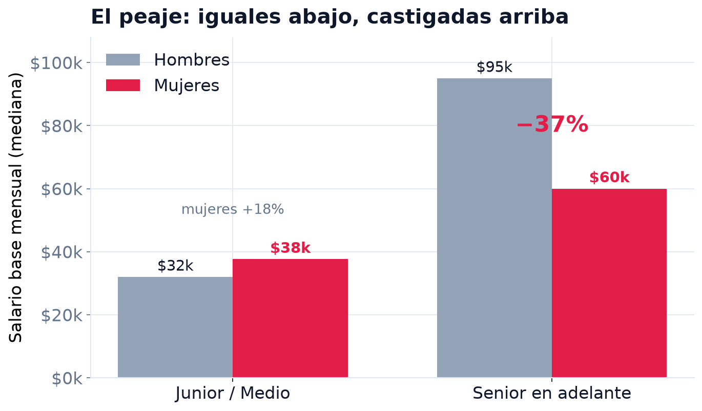
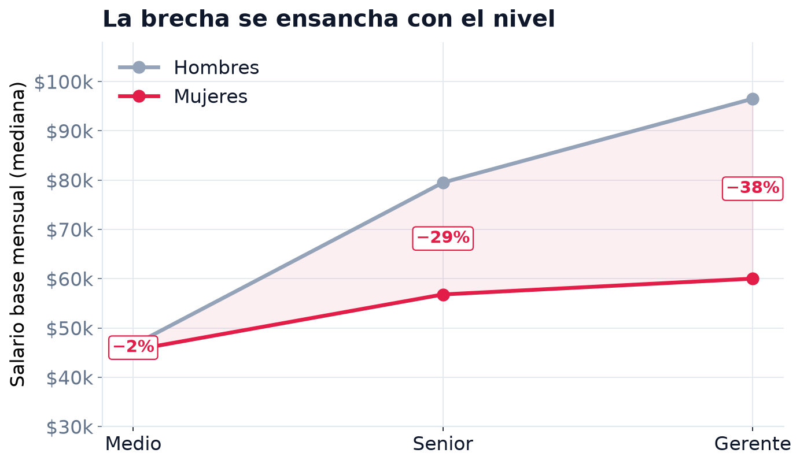
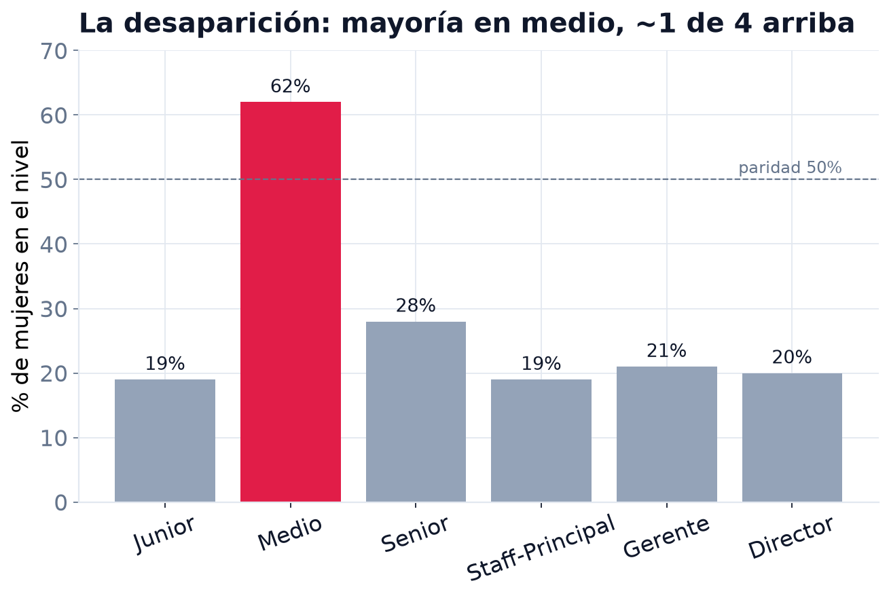
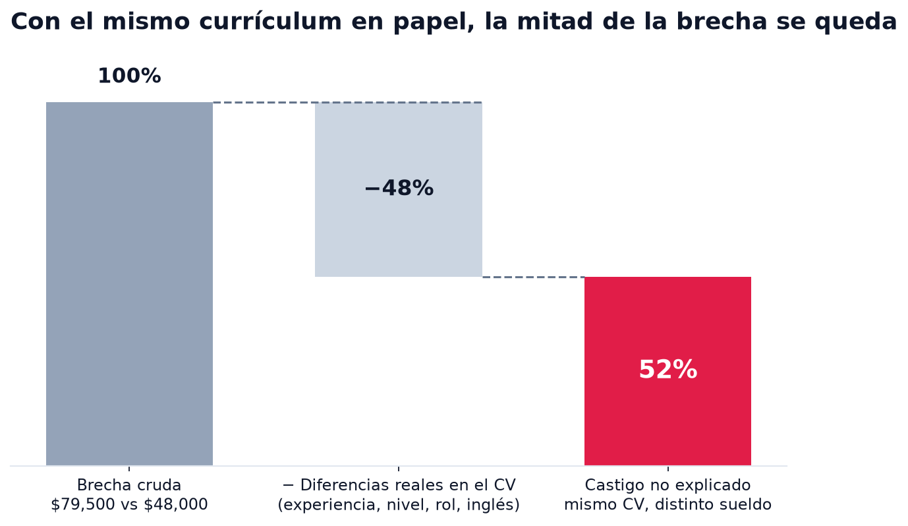
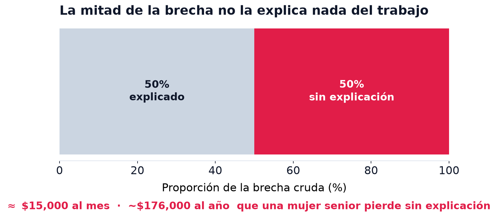
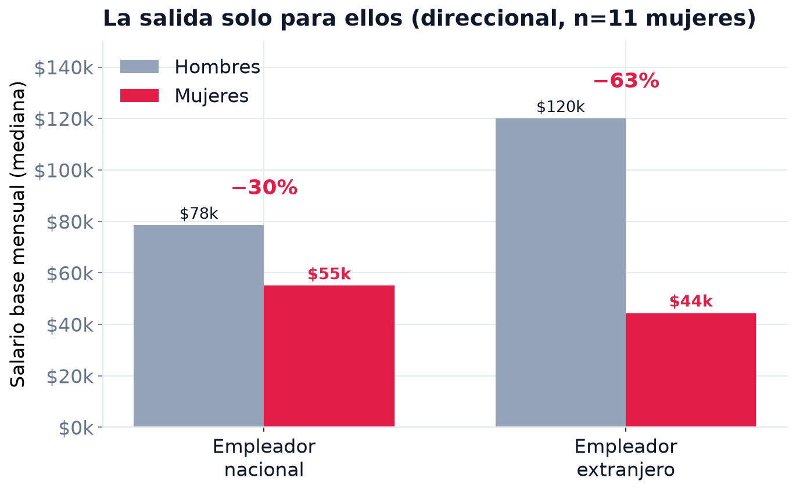
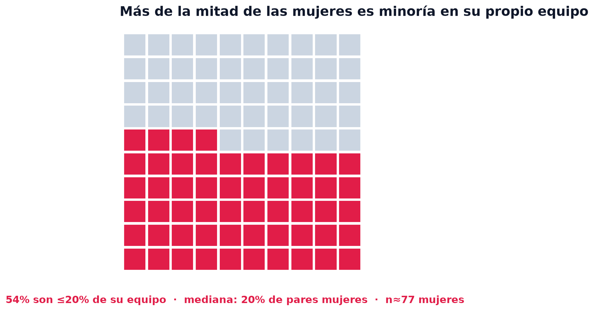
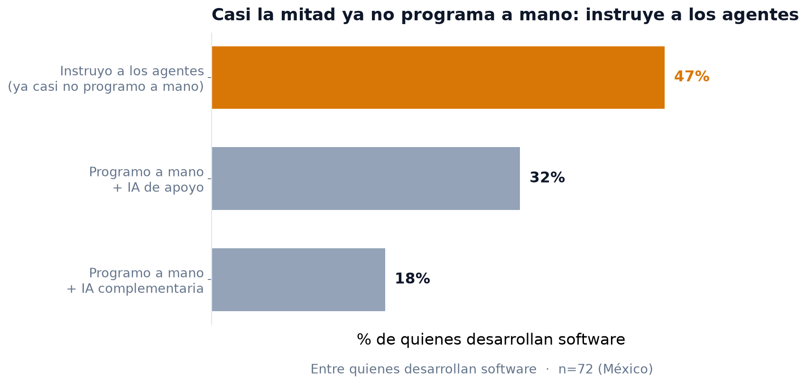

# La brecha de género en el tech mexicano

**SG Tech Pulse 2026 · hallazgos preliminares**

"En el tech mexicano, ser mujer cuesta desde el primer día, y cada ascenso lo encarece."

Solo México · n=245 (91 mujeres) · muestra autoseleccionada, cifras direccionales

---
layout: center
class: text-center
---

# El costo se acumula

Empieza desde temprano y crece con cada ascenso.

−40%

brecha cruda de salario base (mediana)

−13% → −42%

de junior/medio a gerente

52%

de la brecha no la explica nada del trabajo

62% → 32%

mujeres, de nivel medio a senior+

---

# Hallazgo 1 — El costo se acumula

La brecha ya existe temprano (<b class="text-rose-600">−13%</b>) y crece con cada nivel hasta <b class="text-rose-600">−42%</b> en gerencia.

---

# Hallazgo 1 — Cada ascenso encarece ser mujer

Medio <b class="text-rose-600">−24%</b> → Senior <b class="text-rose-600">−28%</b> → Gerente <b class="text-rose-600">−42%</b>. Entre más alto, más cuesta.

---

# Hallazgo 2 — La desaparición

Mayoría en el nivel medio (<b>62%</b>), y apenas <b>~1 de cada 3</b> en senior o más. El conteo se adelgaza justo donde crece el castigo.

---

# Hallazgo 3 — Los pesos sin explicación

Emparejamos hombres y mujeres con el <b>mismo currículum en papel</b> (misma experiencia, nivel, rol e inglés): la mitad de la brecha desaparece, la otra mitad se queda.

---
layout: center
---

# Hallazgo 3 — Y esa mitad, en pesos

La mitad que <b>nada del trabajo explica</b> se traduce en <b class="text-rose-600">~$15,000 al mes</b> (~$176,000 al año) para una mujer senior.

---

# Hallazgo 4 — La salida solo para ellos

El mayor aumento del mercado (trabajar para el extranjero) casi no llega a ellas.
(direccional, n=12 mujeres)

---

# El aislamiento

La experiencia de las mujeres · sección solo-mujeres (n≈77)

<b class="text-rose-600">54%</b> de las mujeres son ≤20% de su equipo (mediana: 20% de pares mujeres). Son la excepción en su propia sala.

---
layout: center
class: text-center
---

# Qué significa

- **El castigo empieza temprano y se acumula con el nivel.** A las mujeres ya se les paga menos desde temprano y la brecha crece con cada peldaño hacia la gerencia. La mitad no la explican las cualificaciones. Es un problema de pago y progresión, no de entrada al pipeline.
- **Peticiones:** auditorías de equidad salarial en todos los niveles (no solo la cima); programas formales de mujeres hacia el liderazgo (69% reporta que no hay ninguno).

"En el tech mexicano, ser mujer cuesta desde el primer día, y cada ascenso lo encarece."

---

# Bonus — La IA ya cambió cómo se programa

Y paga: quienes trabajan así ganan una mediana de <b style="color:#d97706">$79,000</b> vs $58,000 (<b>+36%</b>). (descriptivo, no causal; n=72 desarrolladores · hilo aparte de la brecha)

¿Y las mujeres van en esta ola o se quedan atrás? <b>Aún no lo sabemos:</b> solo <b>19 mujeres</b> nos dijeron cómo trabajan con IA, muy pocas para saberlo. Si eres mujer en tech, tu respuesta define el número. <b class="text-rose-600">Responde SG Tech Pulse 2026.</b>

---
layout: center
class: text-sm
---

# Nota metodológica

Restringido a residentes en México (92% de la muestra). Salario base normalizado a MXN (USD × TC 18.5, robusto entre 17–20); log para regresión; outliers ~$8k–$400k recortados. Brecha cruda con IC bootstrap; descomposición Oaxaca-Blinder (controles: experiencia, seniority, inglés, familia de rol). Celdas con <5 mujeres suprimidas; personas no binarias (n=4) excluidas de la inferencia.

**Lo no explicado no equivale a discriminación probada:** también contiene factores no medidos, incluidos los ítems de mecanismo (negociación, patrocinio, promoción) eliminados del formulario desplegado. Muestra autoseleccionada y preliminar; el hallazgo 4 es direccional (n=12 mujeres).

Detalle completo: `docs/GENDER_FINDINGS_2026.md` / `_ES_MX.md`.
